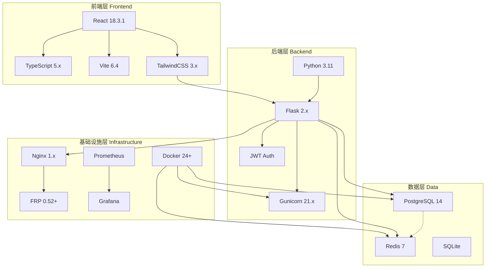
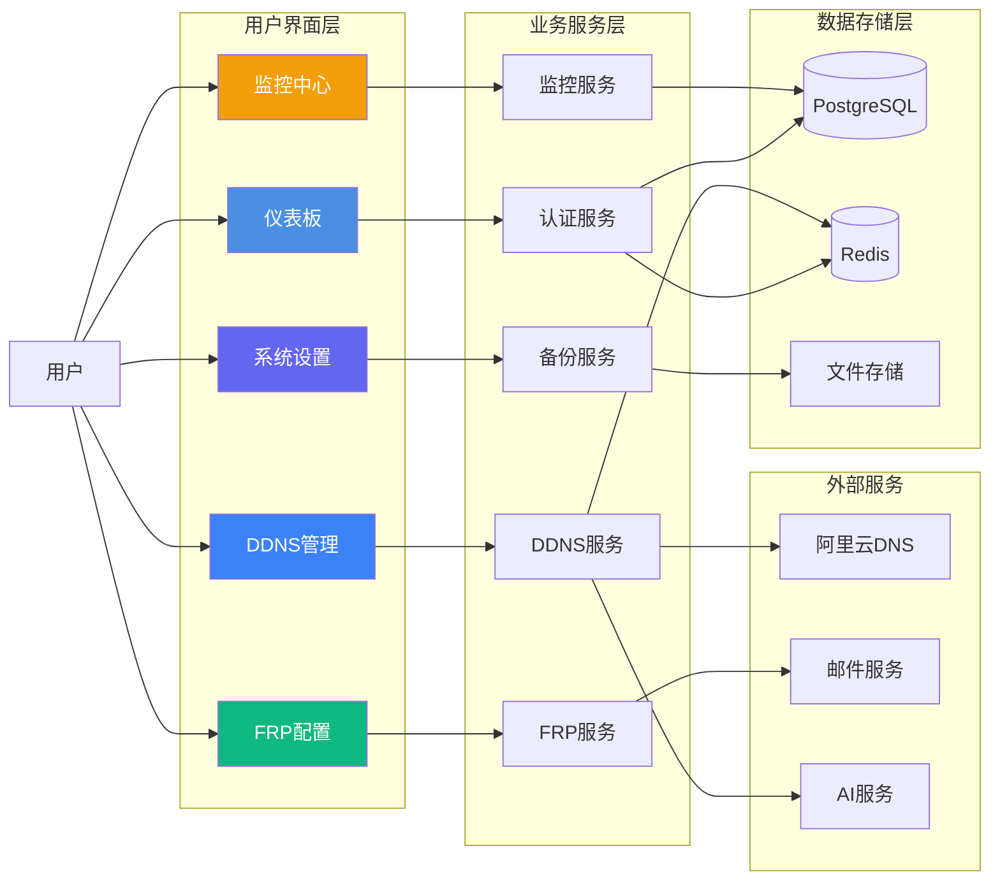

<div align="center">


# YYC³ NAS-ECS 企业级智能管理平台

> ***YanYuCloudCube***
> 言启象限 | 语枢未来
> ***Words Initiate Quadrants, Language Serves as Core for the Future***
> 万象归元于云枢 | 深栈智启新纪元
> ***All things converge in the cloud pivot; Deep stacks ignite a new era of intelligence***

[](https://github.com/YYC-Cube/YYC3-NAS-ECS/releases)
[](LICENSE)
[](https://reactjs.org/)
[](https://www.typescriptlang.org/)
[](https://github.com/YYC-Cube/YYC3-NAS-ECS/stargazers)
[](https://github.com/YYC-Cube/YYC3-NAS-ECS/network/members)
[](https://github.com/YYC-Cube/YYC3-NAS-ECS/issues)

</div>

---

## 📋 项目概述

YYC³ NAS-ECS 是一个基于云原生架构的企业级智能管理平台，提供 NAS 管理、DDNS 动态解析、内网穿透、监控告警等完整功能。

### 核心特性

| 特性 | 说明 | 技术实现 |
|------|------|----------|
| 🔒 **安全管理** | 企业级认证授权、数据加密、安全审计 | JWT + RBAC + HTTPS |
| 🌐 **内网穿透** | 基于 FRP 的稳定内网穿透服务 | FRP 0.52+ + Nginx |
| 📡 **DDNS 服务** | 支持阿里云、腾讯云、Cloudflare 等 DNS 服务 | 定时任务 + DNS API |
| 📊 **实时监控** | CPU、内存、磁盘、网络全方位监控 | Prometheus + Grafana |
| 📧 **智能备份** | 自动化备份、恢复、版本管理 | Docker 卷 + 定时任务 |
| 🤖 **AI 集成** | 智能分析、自动化运维、预测性维护 | LLM API + 智能助手 |

### 技术栈



---

## 🚀 快速开始

### 前置要求

| 依赖 | 版本要求 | 用途 |
|------|----------|------|
| Node.js | >= 18.0 | 前端运行环境 |
| Python | >= 3.10 | 后端运行环境 |
| Docker | >= 20.10 | 容器化部署 |
| Git | >= 2.30 | 版本控制 |

### 安装步骤

#### 1. 克隆项目

```bash
git clone https://github.com/YYC-Cube/YYC3-NAS-ECS.git
cd YYC3-NAS-ECS
```

#### 2. 配置环境变量

```bash
# 复制配置模板
cp .env.example .env

# 编辑配置文件，设置实际值
vim .env
```

**重要提示**：

- 请参考 [docs/开发者指南-敏感信息占位符使用说明.md](./docs/开发者指南-敏感信息占位符使用说明.md) 了解占位符说明
- 不要将包含实际敏感信息的 `.env` 文件提交到 Git
- 使用强密码和安全的密钥

#### 3. 安装依赖

```bash
# 前端依赖
npm install

# 后端依赖（如需独立运行后端）
cd api
pip install -r requirements.txt
```

#### 4. 启动开发环境

```bash
# 启动前端开发服务器
npm run dev

# 前端将在 http://localhost:5173 启动
```

#### 5. 构建生产版本

```bash
# 构建前端
npm run build

# 构建输出到 dist/ 目录
```

---

## 📁 项目结构

```
YYC3-NAS-ECS/
├── src/                      # 前端源代码
│   ├── app/                # React 应用
│   │   ├── components/      # UI 组件
│   │   ├── services/        # API 服务
│   │   ├── config/          # 配置管理
│   │   └── utils/           # 工具函数
│   ├── styles/             # 样式文件
│   └── main.tsx            # 入口文件
├── api/                      # 后端源代码
│   ├── app/                # Flask 应用
│   ├── config/             # 配置文件
│   ├── migrations/          # 数据库迁移
│   ├── docker/             # Docker 配置
│   └── requirements.txt     # Python 依赖
├── services/                 # 微服务
│   ├── ai/                # AI 服务
│   ├── ddns/              # DDNS 服务
│   ├── mail/              # 邮件服务
│   ├── frp/               # FRP 服务
│   └── redis/             # Redis 服务
├── scripts/                  # 部署脚本
│   ├── replace-secrets.sh  # 占位符替换脚本
│   └── *.sh              # 其他脚本
├── docs/                     # 文档
│   ├── architecture.md     # 技术架构文档
│   ├── 开发者指南-敏感信息占位符使用说明.md
│   └── *.md             # 详细文档
├── nas-ecs/                  # 部署包
│   ├── docker/             # Docker 配置
│   ├── config/             # 环境配置
│   └── scripts/            # 部署脚本
├── public/                   # 静态资源
│   └── badges/             # 徽章图标
├── .env.example               # 环境变量模板
├── .env                      # 实际环境变量（不提交）
├── .gitignore                # Git 忽略规则
├── package.json               # Node.js 依赖
├── docker-compose.yml         # Docker 编排
└── README.md                 # 本文件
```

---

## 🔧 环境变量配置

### 核心配置项

| 配置项 | 说明 | 占位符 | 必填 |
|-------|------|--------|------|
| `POSTGRES_USER` | 数据库用户名 | `DB_USER_PLACEHOLDER` | ✅ |
| `POSTGRES_PASSWORD` | 数据库密码 | `DB_PASSWORD_PLACEHOLDER` | ✅ |
| `JWT_SECRET_KEY` | JWT 签名密钥 | `JWT_SECRET_PLACEHOLDER` | ✅ |
| `SESSION_SECRET` | Session 加密密钥 | `SESSION_SECRET_PLACEHOLDER` | ✅ |
| `API_KEY` | API 访问密钥 | `API_KEY_PLACEHOLDER` | ✅ |
| `SERVER_IP` | 服务器 IP 地址 | `SERVER_IP_PLACEHOLDER` | ✅ |
| `ALIYUN_ACCESS_KEY_ID` | 阿里云 AccessKey ID | `ALIYUN_ACCESS_KEY_ID_PLACEHOLDER` | ❌ |
| `ALIYUN_ACCESS_KEY_SECRET` | 阿里云 AccessKey Secret | `ALIYUN_ACCESS_KEY_SECRET_PLACEHOLDER` | ❌ |

### 环境类型

- **development** - 开发环境
- **staging** - 预发布环境
- **production** - 生产环境

详细配置说明请参考：

- [docs/开发者指南-敏感信息占位符使用说明.md](./docs/开发者指南-敏感信息占位符使用说明.md)
- [docs/architecture.md](./docs/architecture.md) - 完整技术架构文档

---

## 📝 可用脚本

### 占位符替换脚本

```bash
./scripts/replace-secrets.sh
```

功能：批量将项目中的敏感信息替换为占位符

### 快速启动脚本

```bash
./scripts/quick-start.sh
```

功能：快速启动所有开发服务

### 部署脚本

```bash
./scripts/deploy.sh
```

功能：部署到生产环境

---

## 🏗️ 功能架构

### 系统功能模块



### 数据流转


---

## 🔒 安全最佳实践

### 密码管理

✅ **推荐做法**：

- 使用至少 16 位的强密码
- 包含大小写字母、数字和特殊字符
- 定期轮换密码（建议每 90 天）
- 使用密码管理器（如 1Password、Bitwarden）

❌ **避免做法**：

- 使用简单密码（如 `password123`）
- 在代码中硬编码密码
- 多个服务使用相同密码

### 密钥管理

✅ **推荐做法**：

- 使用环境特定的密钥（开发/测试/生产）
- 使用密钥管理服务
- 生成足够长度的密钥（至少 32 字符）
- 使用加密存储

❌ **避免做法**：

- 在代码中硬编码密钥
- 将密钥提交到版本控制
- 在文档中记录实际密钥

### Git 安全

✅ **推荐做法**：

- 确保 `.env` 在 `.gitignore` 中
- 使用 `pre-commit` 钩子检查敏感信息
- 定期审查 Git 历史记录

❌ **避免做法**：

- 提交 `.env` 文件
- 提交包含密钥的配置文件

---

## 📚 文档导航

### 核心文档

| 文档 | 说明 | 链接 |
|------|------|------|
| **技术架构文档** | 完整的系统架构、数据流、部署架构 | [docs/architecture.md](./docs/architecture.md) |
| **开发者指南** | 占位符完整说明、安全最佳实践 | [docs/开发者指南-敏感信息占位符使用说明.md](./docs/开发者指南-敏感信息占位符使用说明.md) |
| **FRP 配置指南** | FRP 内网穿透详细配置 | [docs/YYC3-NAS-ECS-FRP配置使用指南.md](./docs/YYC3-NAS-ECS-FRP配置使用指南.md) |
| **非技术部署指南** | 简化部署流程、快速上手 | [YYC3-NAS-ECS-非技术人士部署指南.md](./YYC3-NAS-ECS-非技术人士部署指南.md) |
| **安全策略** | 安全策略与最佳实践 | [SECURITY.md](./SECURITY.md) |

### 快速链接

- 🚀 [在线演示](https://nas-ecs.0379.email)
- 📖 [API 文档](https://api.0379.email/docs)
- 📧 [技术支持](mailto:admin@0379.email)
- 🐛 [问题反馈](https://github.com/YYC-Cube/YYC3-NAS-ECS/issues)

---

## 🤝 贡献指南

### 开发流程


### 提交代码

1. Fork 本仓库
2. 创建特性分支 (`git checkout -b feature/amazing-feature`)
3. 提交更改 (`git commit -m 'Add some amazing feature'`)
4. 推送到分支 (`git push origin feature/amazing-feature`)
5. 开启 Pull Request

### 代码规范

- 遵循 YYC³ 代码规范
- 使用占位符替代敏感信息
- 编写单元测试
- 更新相关文档

### 提交信息规范

```
<type>(<scope>): <subject>

<body>

<footer>
```

类型（type）：

- `feat`: 新功能
- `fix`: Bug 修复
- `docs`: 文档更新
- `style`: 代码格式调整
- `refactor`: 代码重构
- `perf`: 性能优化
- `test`: 测试相关
- `chore`: 构建或辅助工具变动

---

## 📊 项目统计

<div align="center">


</div>

### 贡献者

感谢所有为 YYC³ NAS-ECS 做出贡献的开发者！

<a href="https://github.com/YYC-Cube/YYC3-NAS-ECS/graphs/contributors">
  
</a>

---

## 📄 许可证

本项目采用 MIT 许可证 - 详见 [LICENSE](LICENSE) 文件

---

## 📞 技术支持

| 支持类型 | 联系方式 |
|----------|----------|
| **技术邮箱** | <admin@0379.email> |
| **GitHub Issues** | <https://github.com/YYC-Cube/YYC3-NAS-ECS/issues> |
| **文档中心** | <https://docs.0379.email> |
| **在线支持** | <https://support.0379.email> |

---

<div align="center">

> **言启象限 | 语枢未来**
>
> **Words Initiate Quadrants, Language Serves as Core for the Future**
>
> 万象归元于云枢 | 深栈智启新纪元
>
> **All things converge in the cloud pivot; Deep stacks ignite a new era of intelligence**

---

**项目版本**: 1.0.0  
**最后更新**: 2026-02-13  
**维护者**: YYC³ Team  
**许可协议**: MIT  
**项目地址**: <https://github.com/YYC-Cube/YYC3-NAS-ECS>

---

<div align="center">

Made with ❤️ by YYC³ Team

</div>

</div>
