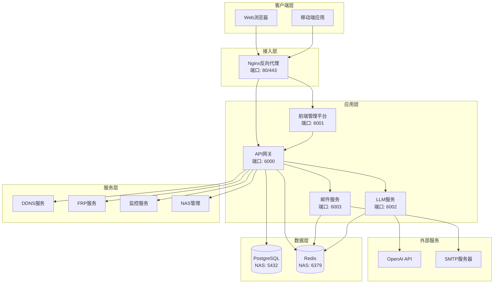

# YYC³ 开发指导

<div align="center">


> **言启象限 | 语枢未来**
> 
> **Words Initiate Quadrants, Language Serves as Core for the Future**

[](https://github.com/YYC-Cube/YYC3-NAS-ECS)
[](../LICENSE)
[](#项目状态)
[](https://www.docker.com/)
[](https://nodejs.org/)
[](https://www.python.org/)
[](../.trae/rules/project_rules.md)

**万象归元于云枢 | 深栈智启新纪元**
**All things converge in the cloud pivot; Deep stacks ignite a new era of intelligence**

[快速开始](#快速开始) • [项目架构](#项目架构) • [开发指南](#开发指南) • [API文档](#api文档) • [部署指南](#部署指南) • [常见问题](#常见问题)

</div>

---

## 📋 目录

- [项目概述](#项目概述)
- [快速开始](#快速开始)
- [项目架构](#项目架构)
- [开发环境搭建](#开发环境搭建)
- [开发指南](#开发指南)
  - [前端开发](#前端开发)
  - [后端开发](#后端开发)
  - [LLM服务开发](#llm服务开发)
  - [邮件服务开发](#邮件服务开发)
- [API文档](#api文档)
- [测试指南](#测试指南)
- [部署指南](#部署指南)
- [代码规范](#代码规范)
- [故障排查](#故障排查)
- [常见问题](#常见问题)
- [贡献指南](#贡献指南)

---

## 🎯 项目概述

YYC³ 企业管理平台是一个基于微服务架构的现代化企业管理系统，集成了NAS管理、DDNS服务、FRP内网穿透、LLM智能助手、邮件服务等多种功能。

### 核心特性

- ✅ **微服务架构**: 模块化设计，易于扩展和维护
- ✅ **容器化部署**: 基于Docker和Docker Compose的容器化方案
- ✅ **智能AI集成**: 集成OpenAI GPT模型，提供智能对话能力
- ✅ **实时监控**: 系统性能监控和告警机制
- ✅ **安全加固**: 多层次的安全防护措施
- ✅ **高可用性**: 支持负载均衡和故障转移

### 技术栈

| 层级 | 技术 |
|------|------|
| 前端 | React 18, TypeScript, Vite, Tailwind CSS, shadcn/ui |
| 后端 | Python 3.9+, Flask, FastAPI, Node.js |
| 数据库 | PostgreSQL 14, Redis 7 |
| 容器化 | Docker, Docker Compose |
| 反向代理 | Nginx |
| 内网穿透 | FRP |
| AI服务 | OpenAI GPT API |

### 项目状态

```
┌─────────────────────────────────────────────────────────────┐
│  🟢 开发环境: 正常运行                                        │
│  🟢 API服务: 正常运行 (http://localhost:6000)                 │
│  🟢 前端服务: 正常运行 (http://localhost:6001)                │
│  🟢 LLM服务: 正常运行 (http://localhost:6002)                │
│  🟢 邮件服务: 正常运行 (http://localhost:6003)                │
│  🟢 Redis: 正常连接 (NAS服务器: 192.168.1.100:6379)          │
│  🟢 PostgreSQL: 正常连接 (NAS服务器: 192.168.1.100:5432)     │
└─────────────────────────────────────────────────────────────┘
```

---

## 🚀 快速开始

### 前置要求

- Docker 20.10+
- Docker Compose 2.0+
- Node.js 18+
- Python 3.9+
- PostgreSQL 14 (NAS服务器)
- Redis 7 (NAS服务器)

### 一键启动

```bash
# 克隆项目
git clone https://github.com/YYC-Cube/YYC3-NAS-ECS.git
cd yyc3-nas-ecs

# 启动所有服务
./scripts/quick-start.sh

# 访问前端管理平台
open http://localhost:6001
```

### 验证安装

```bash
# 检查服务状态
./scripts/health-check.sh

# 查看日志
./scripts/view-logs.sh
```

---

## 🏗️ 项目架构

### 系统架构图



### 目录结构

```
YYC3-NAS-ECS/
├── api/                      # API服务
│   ├── app/                  # Flask应用
│   │   ├── api/             # API路由
│   │   │   └── v2/         # API v2版本
│   │   ├── models/         # 数据模型
│   │   ├── services/       # 业务逻辑
│   │   └── utils/          # 工具函数
│   ├── docker/             # Docker配置
│   │   └── nginx/         # Nginx配置
│   ├── tests/              # 测试文件
│   ├── requirements.txt     # Python依赖
│   └── Dockerfile         # Docker镜像构建
├── frontend/                # 前端应用
│   ├── src/                # 源代码
│   │   ├── components/     # React组件
│   │   ├── pages/         # 页面
│   │   ├── services/      # API服务
│   │   └── utils/         # 工具函数
│   ├── public/            # 静态资源
│   ├── package.json       # Node依赖
│   └── vite.config.ts     # Vite配置
├── mail/                    # 邮件服务
│   ├── server.js          # 邮件服务器
│   ├── config/            # 配置文件
│   └── logs/              # 日志文件
├── llm/                     # LLM服务
│   ├── main.py            # FastAPI应用
│   ├── config/            # 配置文件
│   └── logs/              # 日志文件
├── frp/                     # FRP服务
│   ├── frpc.toml          # FRP客户端配置
│   └── logs/              # 日志文件
├── redis/                   # Redis服务
│   └── config/            # 配置文件
├── scripts/                 # 脚本工具
│   ├── quick-start.sh     # 快速启动脚本
│   ├── health-check.sh    # 健康检查脚本
│   └── view-logs.sh       # 日志查看脚本
├── docs/                    # 文档
│   ├── README.md          # 文档中心
│   ├── YYC3-LP-文档索引.md
│   └── YYC3-NAS-开发指导/
├── docker-compose.yml       # Docker Compose配置
├── .env.example            # 环境变量示例
└── .gitignore             # Git忽略文件
```

---

## 💻 开发环境搭建

### 1. 克隆项目

```bash
git clone https://github.com/YYC-Cube/YYC3-NAS-ECS.git
cd yyc3-nas-ecs
```

### 2. 配置环境变量

```bash
# 复制环境变量示例文件
cp .env.example .env

# 编辑环境变量
vim .env
```

### 3. 启动依赖服务

```bash
# 启动Redis（如果本地需要）
cd redis
docker-compose -f config/docker-compose.yml up -d redis-dev
cd ..

# 启动PostgreSQL（如果本地需要）
# 注意：生产环境使用NAS服务器上的PostgreSQL
```

### 4. 安装依赖

```bash
# 安装前端依赖
cd frontend
npm install
cd ..

# 安装API依赖
cd api
pip install -r requirements.txt
cd ..

# 安装LLM依赖
cd llm
pip install -r requirements.txt
cd ..

# 安装邮件服务依赖
cd mail
npm install
cd ..
```

### 5. 启动开发服务

```bash
# 使用快速启动脚本
./scripts/quick-start.sh

# 或手动启动各个服务
cd api && docker-compose up -d && cd ..
cd mail && npm start && cd ..
cd llm && python main.py && cd ..
cd frontend && npm run dev && cd ..
```

### 6. 验证环境

```bash
# 检查服务健康状态
./scripts/health-check.sh

# 访问服务
# 前端: http://localhost:6001
# API: http://localhost:6000
# API文档: http://localhost:6000/api/v2/docs
```

---

## 📚 开发指南

### 前端开发

#### 技术栈

- React 18
- TypeScript
- Vite
- Tailwind CSS
- shadcn/ui
- React Query
- Zustand

#### 开发命令

```bash
cd frontend

# 安装依赖
npm install

# 启动开发服务器
npm run dev

# 构建生产版本
npm run build

# 预览生产构建
npm run preview

# 运行测试
npm run test

# 代码检查
npm run lint

# 代码格式化
npm run format
```

#### 项目结构

```
frontend/
├── src/
│   ├── components/        # 通用组件
│   │   ├── ui/           # shadcn/ui组件
│   │   ├── layout/       # 布局组件
│   │   └── common/       # 通用组件
│   ├── pages/            # 页面组件
│   │   ├── Dashboard/    # 仪表盘
│   │   ├── NAS/          # NAS管理
│   │   ├── DDNS/         # DDNS管理
│   │   ├── FRP/          # FRP管理
│   │   ├── Mail/         # 邮件管理
│   │   └── LLM/          # LLM对话
│   ├── services/         # API服务
│   │   ├── api.ts       # API客户端
│   │   ├── auth.ts      # 认证服务
│   │   └── websocket.ts # WebSocket服务
│   ├── stores/           # 状态管理
│   │   ├── auth.ts      # 认证状态
│   │   ├── ui.ts        # UI状态
│   │   └── data.ts      # 数据状态
│   ├── utils/            # 工具函数
│   │   ├── format.ts    # 格式化函数
│   │   ├── validate.ts  # 验证函数
│   │   └── constants.ts # 常量
│   ├── types/            # TypeScript类型定义
│   ├── hooks/            # 自定义Hooks
│   ├── App.tsx          # 应用根组件
│   └── main.tsx         # 应用入口
├── public/              # 静态资源
├── index.html           # HTML模板
├── package.json         # 项目配置
├── tsconfig.json        # TypeScript配置
├── vite.config.ts       # Vite配置
└── tailwind.config.js   # Tailwind配置
```

#### 组件开发规范

```typescript
/**
 * @file 组件文件名
 * @description 组件描述
 * @author YYC³
 * @version 1.0.0
 */

import React, { useState, useEffect } from 'react';
import { Button } from '@/components/ui/button';
import { Card, CardContent, CardHeader, CardTitle } from '@/components/ui/card';

interface ComponentProps {
  /** 属性描述 */
  prop1: string;
  /** 属性描述 */
  prop2?: number;
  /** 回调函数 */
  onAction?: () => void;
}

/**
 * 组件描述
 * @param props - 组件属性
 * @returns JSX元素
 */
export const ComponentName: React.FC<ComponentProps> = ({
  prop1,
  prop2 = 0,
  onAction,
}) => {
  const [state, setState] = useState<string>('');

  useEffect(() => {
    // 副作用逻辑
  }, []);

  const handleClick = () => {
    onAction?.();
  };

  return (
    <Card>
      <CardHeader>
        <CardTitle>{prop1}</CardTitle>
      </CardHeader>
      <CardContent>
        <Button onClick={handleClick}>操作</Button>
      </CardContent>
    </Card>
  );
};
```

#### API调用示例

```typescript
import { apiClient } from '@/services/api';

// GET请求
const fetchData = async () => {
  try {
    const response = await apiClient.get('/api/system/stats');
    console.log(response.data);
  } catch (error) {
    console.error('请求失败:', error);
  }
};

// POST请求
const createItem = async (data: any) => {
  try {
    const response = await apiClient.post('/api/items', data);
    return response.data;
  } catch (error) {
    console.error('创建失败:', error);
    throw error;
  }
};

// 带参数的请求
const searchItems = async (query: string, page: number = 1) => {
  try {
    const response = await apiClient.get('/api/items', {
      params: { q: query, page }
    });
    return response.data;
  } catch (error) {
    console.error('搜索失败:', error);
    throw error;
  }
};
```

### 后端开发

#### 技术栈

- Python 3.9+
- Flask
- FastAPI
- SQLAlchemy
- Pydantic
- Redis
- PostgreSQL

#### 开发命令

```bash
cd api

# 安装依赖
pip install -r requirements.txt

# 启动开发服务器
python run.py

# 运行测试
pytest

# 代码检查
flake8

# 代码格式化
black .
```

#### 项目结构

```
api/
├── app/
│   ├── __init__.py       # 应用工厂
│   ├── config.py         # 配置管理
│   ├── extensions.py     # 扩展初始化
│   ├── models/          # 数据模型
│   │   ├── user.py      # 用户模型
│   │   ├── nas.py       # NAS模型
│   │   └── ddns.py      # DDNS模型
│   ├── api/             # API路由
│   │   └── v2/         # API v2版本
│   │       ├── __init__.py
│   │       ├── nas_api.py
│   │       ├── ddns_api.py
│   │       ├── monitoring_api.py
│   │       └── mail_api.py
│   ├── services/        # 业务逻辑
│   │   ├── nas_service.py
│   │   ├── ddns_service.py
│   │   └── monitoring_service.py
│   └── utils/           # 工具函数
│       ├── auth.py      # 认证工具
│       ├── logger.py    # 日志工具
│       └── cache.py     # 缓存工具
├── tests/               # 测试文件
│   ├── unit/           # 单元测试
│   ├── integration/    # 集成测试
│   └── e2e/           # 端到端测试
├── requirements.txt     # Python依赖
├── Dockerfile          # Docker镜像
├── docker-compose.yml  # Docker Compose配置
└── run.py             # 应用入口
```

#### API路由开发规范

```python
"""
@file API路由文件
@description API路由描述
@author YYC³
@version 1.0.0
"""

from flask import Blueprint, request, jsonify
from app.services.nas_service import nas_service
from app.utils.auth import authenticate_token
from app.utils.logger import logger

# 创建蓝图
nas_bp = Blueprint('nas', __name__)

@nas_bp.route('/status', methods=['GET'])
@authenticate_token
def get_nas_status():
    """
    获取NAS状态
    
    Returns:
        JSON响应，包含NAS状态信息
    """
    try:
        status = nas_service.get_status()
        return jsonify({
            'success': True,
            'data': status
        })
    except Exception as e:
        logger.error(f'获取NAS状态失败: {e}')
        return jsonify({
            'success': False,
            'error': {
                'code': 'NAS_STATUS_ERROR',
                'message': '获取NAS状态失败'
            }
        }), 500

@nas_bp.route('/files', methods=['GET'])
@authenticate_token
def list_files():
    """
    列出NAS文件
    
    Query Parameters:
        path: 文件路径
        recursive: 是否递归列出
        
    Returns:
        JSON响应，包含文件列表
    """
    try:
        path = request.args.get('path', '/')
        recursive = request.args.get('recursive', 'false').lower() == 'true'
        
        files = nas_service.list_files(path, recursive)
        return jsonify({
            'success': True,
            'data': files
        })
    except Exception as e:
        logger.error(f'列出文件失败: {e}')
        return jsonify({
            'success': False,
            'error': {
                'code': 'LIST_FILES_ERROR',
                'message': '列出文件失败'
            }
        }), 500
```

#### 数据模型开发规范

```python
"""
@file 数据模型文件
@description 数据模型描述
@author YYC³
@version 1.0.0
"""

from sqlalchemy import Column, Integer, String, DateTime, Boolean
from sqlalchemy.ext.declarative import declarative_base
from datetime import datetime

Base = declarative_base()

class User(Base):
    """用户模型"""
    __tablename__ = 'users'
    
    id = Column(Integer, primary_key=True, autoincrement=True)
    username = Column(String(50), unique=True, nullable=False, index=True)
    email = Column(String(100), unique=True, nullable=False, index=True)
    password_hash = Column(String(255), nullable=False)
    role = Column(String(20), default='user', nullable=False)
    is_active = Column(Boolean, default=True, nullable=False)
    created_at = Column(DateTime, default=datetime.utcnow, nullable=False)
    updated_at = Column(DateTime, default=datetime.utcnow, onupdate=datetime.utcnow, nullable=False)
    
    def to_dict(self):
        """转换为字典"""
        return {
            'id': self.id,
            'username': self.username,
            'email': self.email,
            'role': self.role,
            'is_active': self.is_active,
            'created_at': self.created_at.isoformat(),
            'updated_at': self.updated_at.isoformat()
        }
    
    def __repr__(self):
        return f'<User {self.username}>'
```

### LLM服务开发

#### 技术栈

- Python 3.9+
- FastAPI
- OpenAI API
- Redis
- Pydantic

#### 开发命令

```bash
cd llm

# 安装依赖
pip install -r requirements.txt

# 启动开发服务器
uvicorn main:app --reload --host 0.0.0.0 --port 6002

# 运行测试
pytest

# 代码检查
flake8

# 代码格式化
black .
```

#### 项目结构

```
llm/
├── main.py              # FastAPI应用入口
├── config.py           # 配置管理
├── services/           # 业务逻辑
│   ├── openai_service.py
│   ├── conversation_service.py
│   └── cache_service.py
├── models/             # 数据模型
│   ├── chat.py
│   └── conversation.py
├── utils/              # 工具函数
│   ├── logger.py
│   └── validators.py
├── tests/              # 测试文件
├── requirements.txt     # Python依赖
└── Dockerfile          # Docker镜像
```

#### API端点示例

```python
"""
@file LLM服务主文件
@description LLM服务API
@author YYC³
@version 1.0.0
"""

from fastapi import FastAPI, HTTPException
from fastapi.middleware.cors import CORSMiddleware
from pydantic import BaseModel
from typing import Optional
import logging

# 配置日志
logging.basicConfig(level=logging.INFO)
logger = logging.getLogger(__name__)

# 创建FastAPI应用
app = FastAPI(
    title="YYC³ LLM Service",
    description="LLM智能对话服务",
    version="1.0.0"
)

# CORS配置
app.add_middleware(
    CORSMiddleware,
    allow_origins=["*"],
    allow_credentials=True,
    allow_methods=["*"],
    allow_headers=["*"],
)

# 数据模型
class ChatRequest(BaseModel):
    """聊天请求"""
    message: str
    model: str = "gpt-3.5-turbo"
    temperature: float = 0.7
    max_tokens: int = 2048
    conversation_id: Optional[str] = None

class ChatResponse(BaseModel):
    """聊天响应"""
    id: str
    role: str
    content: str
    model: str
    timestamp: str
    conversation_id: Optional[str] = None

# API路由
@app.get("/")
async def root():
    """根路径"""
    return {
        "message": "YYC³ LLM服务",
        "status": "running",
        "version": "1.0.0"
    }

@app.get("/health")
async def health_check():
    """健康检查"""
    return {
        "status": "healthy",
        "service": "YYC³ LLM",
        "version": "1.0.0"
    }

@app.post("/api/llm/chat", response_model=ChatResponse)
async def chat(request: ChatRequest):
    """
    AI聊天接口
    
    Args:
        request: 聊天请求
        
    Returns:
        聊天响应
    """
    try:
        # 处理聊天逻辑
        response = await process_chat(request)
        return response
    except Exception as e:
        logger.error(f"聊天处理失败: {e}")
        raise HTTPException(status_code=500, detail="聊天处理失败")

async def process_chat(request: ChatRequest) -> ChatResponse:
    """处理聊天请求"""
    # 实现聊天逻辑
    pass
```

### 邮件服务开发

#### 技术栈

- Node.js 18+
- Express
- Nodemailer
- Redis
- TypeScript

#### 开发命令

```bash
cd mail

# 安装依赖
npm install

# 启动开发服务器
npm run dev

# 构建生产版本
npm run build

# 运行测试
npm test

# 代码检查
npm run lint

# 代码格式化
npm run format
```

#### 项目结构

```
mail/
├── server.js           # Express应用入口
├── config/            # 配置文件
│   ├── smtp.js       # SMTP配置
│   └── redis.js      # Redis配置
├── routes/            # 路由定义
│   ├── mail.js       # 邮件路由
│   └── health.js     # 健康检查路由
├── services/          # 业务逻辑
│   ├── mail_service.py
│   └── cache_service.py
├── utils/             # 工具函数
│   ├── logger.js
│   └── validators.js
├── tests/             # 测试文件
├── package.json       # Node依赖
└── Dockerfile        # Docker镜像
```

#### API端点示例

```javascript
/**
 * @file 邮件服务主文件
 * @description 邮件服务API
 * @author YYC³
 * @version 1.0.0
 */

const express = require('express');
const nodemailer = require('nodemailer');
const redis = require('redis');

// 创建Express应用
const app = express();

// 中间件
app.use(express.json());
app.use(express.urlencoded({ extended: true }));

// Redis连接
const redisClient = redis.createClient({
  host: process.env.REDIS_HOST || 'localhost',
  port: process.env.REDIS_PORT || 6379,
  password: process.env.REDIS_PASSWORD
});

// SMTP配置
const smtpTransporter = nodemailer.createTransporter({
  host: process.env.SMTP_HOST,
  port: process.env.SMTP_PORT,
  secure: false,
  auth: {
    user: process.env.SMTP_USER,
    pass: process.env.SMTP_PASS
  }
});

// API路由
app.get('/health', (req, res) => {
  res.json({
    status: 'healthy',
    service: 'YYC³ Mail',
    version: '1.0.0'
  });
});

app.get('/api/mail/emails', async (req, res) => {
  try {
    const { folder = 'inbox', page = 1, limit = 20 } = req.query;
    
    // 获取邮件列表
    const emails = await getEmails(folder, page, limit);
    
    res.json({
      success: true,
      data: emails,
      meta: {
        page: parseInt(page),
        limit: parseInt(limit),
        total: emails.length
      }
    });
  } catch (error) {
    console.error('获取邮件列表失败:', error);
    res.status(500).json({
      success: false,
      error: {
        code: 'GET_EMAILS_ERROR',
        message: '获取邮件列表失败'
      }
    });
  }
});

app.post('/api/mail/send', async (req, res) => {
  try {
    const { to, subject, body, html, cc, bcc } = req.body;
    
    if (!to || !subject || !body) {
      return res.status(400).json({
        success: false,
        error: {
          code: 'MISSING_REQUIRED_FIELDS',
          message: '缺少必填字段'
        }
      });
    }
    
    // 发送邮件
    const info = await smtpTransporter.sendMail({
      from: process.env.SMTP_FROM,
      to: Array.isArray(to) ? to.join(', ') : to,
      cc: cc ? (Array.isArray(cc) ? cc.join(', ') : cc) : undefined,
      bcc: bcc ? (Array.isArray(bcc) ? bcc.join(', ') : bcc) : undefined,
      subject,
      text: body,
      html: html || undefined
    });
    
    res.json({
      success: true,
      data: {
        messageId: info.messageId,
        accepted: info.accepted,
        rejected: info.rejected
      }
    });
  } catch (error) {
    console.error('邮件发送失败:', error);
    res.status(500).json({
      success: false,
      error: {
        code: 'SEND_EMAIL_ERROR',
        message: '邮件发送失败'
      }
    });
  }
});

// 启动服务器
const PORT = process.env.PORT || 6003;
app.listen(PORT, () => {
  console.log(`邮件服务运行在 http://localhost:${PORT}`);
});
```

---

## 📖 API文档

### API端点列表

| 端点 | 方法 | 描述 | 认证 |
|------|------|------|------|
| `/api/health` | GET | 健康检查 | 否 |
| `/api/system/stats` | GET | 系统状态 | 是 |
| `/api/logs` | GET | 日志列表 | 是 |
| `/api/auth/login` | POST | 用户登录 | 否 |
| `/api/mail/emails` | GET | 邮件列表 | 是 |
| `/api/mail/send` | POST | 发送邮件 | 是 |
| `/api/llm/chat` | POST | AI对话 | 是 |
| `/api/nas/status` | GET | NAS状态 | 是 |
| `/api/nas/files` | GET | 文件列表 | 是 |
| `/api/ddns/domains` | GET | DDNS域名列表 | 是 |
| `/api/ddns/update` | POST | 更新DDNS | 是 |
| `/api/monitoring/stats` | GET | 监控统计 | 是 |

### API响应格式

#### 成功响应

```json
{
  "success": true,
  "data": {
    // 响应数据
  },
  "meta": {
    // 元数据（可选）
  }
}
```

#### 错误响应

```json
{
  "success": false,
  "error": {
    "code": "ERROR_CODE",
    "message": "错误描述"
  }
}
```

### 认证方式

使用JWT Token进行认证：

```bash
# 登录获取Token
curl -X POST http://localhost:6000/api/auth/login \
  -H "Content-Type: application/json" \
  -d '{"username":"admin","password":"admin123"}'

# 使用Token访问受保护的API
curl -X GET http://localhost:6000/api/system/stats \
  -H "Authorization: Bearer YOUR_TOKEN_HERE"
```

### API文档访问

- Swagger UI: http://localhost:6000/api/v2/docs
- ReDoc: http://localhost:6000/api/v2/redoc

---

## 🧪 测试指南

### 前端测试

```bash
cd frontend

# 运行单元测试
npm run test:unit

# 运行集成测试
npm run test:integration

# 运行E2E测试
npm run test:e2e

# 生成测试覆盖率报告
npm run test:coverage
```

### 后端测试

```bash
cd api

# 运行单元测试
pytest tests/unit/

# 运行集成测试
pytest tests/integration/

# 运行E2E测试
pytest tests/e2e/

# 生成测试覆盖率报告
pytest --cov=app --cov-report=html
```

### 测试覆盖率要求

- 单元测试覆盖率: ≥ 80%
- 集成测试覆盖率: ≥ 60%
- 关键路径覆盖率: 100%

---

## 🚀 部署指南

### 开发环境部署

```bash
# 使用快速启动脚本
./scripts/quick-start.sh

# 或手动启动
docker-compose up -d
```

### 生产环境部署

#### 1. 准备环境

```bash
# 创建生产环境配置
cp .env.example .env.production

# 编辑生产环境配置
vim .env.production
```

#### 2. 构建镜像

```bash
# 构建所有服务镜像
docker-compose -f docker-compose.prod.yml build

# 或单独构建
docker build -t yyc3-api:latest ./api
docker build -t yyc3-frontend:latest ./frontend
docker build -t yyc3-llm:latest ./llm
docker build -t yyc3-mail:latest ./mail
```

#### 3. 启动服务

```bash
# 启动生产环境
docker-compose -f docker-compose.prod.yml up -d

# 查看服务状态
docker-compose -f docker-compose.prod.yml ps

# 查看日志
docker-compose -f docker-compose.prod.yml logs -f
```

#### 4. 配置Nginx

```nginx
server {
    listen 80;
    server_name api.0379.email;
    
    location / {
        proxy_pass http://localhost:6000;
        proxy_set_header Host $host;
        proxy_set_header X-Real-IP $remote_addr;
        proxy_set_header X-Forwarded-For $proxy_add_x_forwarded_for;
        proxy_set_header X-Forwarded-Proto $scheme;
    }
}

server {
    listen 80;
    server_name app.0379.email;
    
    location / {
        proxy_pass http://localhost:6001;
        proxy_set_header Host $host;
        proxy_set_header X-Real-IP $remote_addr;
        proxy_set_header X-Forwarded-For $proxy_add_x_forwarded_for;
        proxy_set_header X-Forwarded-Proto $scheme;
    }
}
```

#### 5. 配置SSL证书

```bash
# 使用Let's Encrypt获取免费SSL证书
certbot certonly --nginx -d api.0379.email -d app.0379.email

# 或使用自签名证书（仅用于测试）
openssl req -x509 -nodes -days 365 -newkey rsa:2048 \
  -keyout /etc/nginx/ssl/key.pem \
  -out /etc/nginx/ssl/cert.pem
```

### 部署检查清单

- [ ] 环境变量配置正确
- [ ] 数据库连接正常
- [ ] Redis连接正常
- [ ] 所有服务启动成功
- [ ] 健康检查通过
- [ ] SSL证书配置正确
- [ ] Nginx反向代理配置正确
- [ ] 日志收集配置完成
- [ ] 监控告警配置完成
- [ ] 备份策略配置完成

---

## 📝 代码规范

### 命名规范

#### 文件命名

- 组件文件: PascalCase.tsx (如: UserProfile.tsx)
- 工具文件: camelCase.ts (如: userService.ts)
- 配置文件: kebab-case.config.js (如: vite.config.js)
- 文档文件: kebab-case.md (如: api-documentation.md)

#### 变量命名

- 变量: camelCase (如: userName, isActive)
- 常量: UPPER_SNAKE_CASE (如: API_BASE_URL, MAX_RETRY_COUNT)
- 类: PascalCase (如: UserService, DataProcessor)
- 接口/类型: PascalCase (如: UserProps, ApiResponse)

### 代码风格

#### TypeScript/JavaScript

```typescript
// 使用2空格缩进
// 使用单引号
// 使用分号
// 使用箭头函数

const fetchData = async (url: string): Promise<Data> => {
  try {
    const response = await fetch(url);
    const data = await response.json();
    return data;
  } catch (error) {
    console.error('请求失败:', error);
    throw error;
  }
};
```

#### Python

```python
# 使用4空格缩进
# 使用双引号
# 遵循PEP 8规范

def fetch_data(url: str) -> dict:
    """获取数据"""
    try:
        response = requests.get(url)
        data = response.json()
        return data
    except Exception as error:
        logger.error(f'请求失败: {error}')
        raise
```

### 注释规范

#### 文件头注释

```typescript
/**
 * @file 文件名
 * @description 文件描述
 * @author YYC³
 * @version 1.0.0
 * @created 2025-01-30
 * @updated 2025-01-30
 * @copyright Copyright (c) 2025 YYC³
 * @license MIT
 */
```

#### 函数注释

```typescript
/**
 * 函数描述
 * @param param1 - 参数1描述
 * @param param2 - 参数2描述
 * @returns 返回值描述
 * @throws {Error} 错误描述
 */
function functionName(param1: string, param2: number): boolean {
  // 函数实现
}
```

### Git提交规范

#### 提交格式

```
<类型>[可选 范围]: <描述>

[可选 主体]

[可选 页脚]
```

#### 提交类型

- **feat**: 新功能
- **fix**: Bug修复
- **docs**: 文档更新
- **style**: 代码格式调整
- **refactor**: 代码重构
- **perf**: 性能优化
- **test**: 测试相关
- **chore**: 构建或辅助工具变动

#### 提交示例

```
feat(auth): 添加用户登录功能

实现基于JWT的用户认证系统，包括登录、注册和密码重置功能。

- 添加用户模型和服务
- 实现JWT令牌生成和验证
- 创建登录和注册API端点
- 添加密码加密和验证

Closes #123
```

---

## 🔧 故障排查

### 服务无法启动

#### 问题: Docker容器启动失败

**症状**: 运行`docker-compose up`时容器启动失败

**解决方案**:

```bash
# 查看容器日志
docker-compose logs -f <service_name>

# 检查Docker状态
docker ps -a

# 重新构建镜像
docker-compose build --no-cache

# 清理并重新启动
docker-compose down -v
docker-compose up -d
```

#### 问题: 端口被占用

**症状**: 启动服务时提示端口已被占用

**解决方案**:

```bash
# 查找占用端口的进程
lsof -i :<port>

# 杀死进程
kill -9 <pid>

# 或修改docker-compose.yml中的端口映射
```

### API请求失败

#### 问题: 404 Not Found

**症状**: 访问API端点时返回404错误

**解决方案**:

```bash
# 检查路由定义
# 确保路由路径正确

# 检查蓝图注册
# 确保蓝图正确注册到应用

# 检查URL前缀
# 确保URL前缀配置正确
```

#### 问题: 500 Internal Server Error

**症状**: API请求返回500错误

**解决方案**:

```bash
# 查看服务日志
docker-compose logs -f api

# 检查环境变量配置
docker-compose exec api env

# 检查数据库连接
docker-compose exec api python -c "from app.extensions import db; print(db.engine)"
```

### 数据库连接失败

#### 问题: 无法连接到PostgreSQL

**症状**: 应用启动时提示数据库连接失败

**解决方案**:

```bash
# 检查PostgreSQL服务状态
docker-compose ps postgres

# 查看PostgreSQL日志
docker-compose logs postgres

# 检查数据库连接配置
# 确保.env文件中的数据库配置正确

# 测试数据库连接
docker-compose exec api python -c "
import psycopg2
conn = psycopg2.connect(
    host='postgres',
    database='yyc3',
    user='yyc3',
    password='yyc3_password'
)
print('连接成功')
"
```

### Redis连接失败

#### 问题: 无法连接到Redis

**症状**: 应用启动时提示Redis连接失败

**解决方案**:

```bash
# 检查Redis服务状态
docker-compose ps redis

# 查看Redis日志
docker-compose logs redis

# 测试Redis连接
docker-compose exec redis redis-cli ping

# 检查Redis配置
# 确保.env文件中的Redis配置正确
```

### 前端构建失败

#### 问题: npm install失败

**症状**: 安装依赖时出错

**解决方案**:

```bash
# 清除npm缓存
npm cache clean --force

# 删除node_modules和package-lock.json
rm -rf node_modules package-lock.json

# 重新安装依赖
npm install

# 或使用yarn
yarn install
```

#### 问题: npm run build失败

**症状**: 构建生产版本时出错

**解决方案**:

```bash
# 检查TypeScript错误
npm run type-check

# 检查ESLint错误
npm run lint

# 清除构建缓存
rm -rf dist

# 重新构建
npm run build
```

---

## ❓ 常见问题

### Q1: 如何重置数据库？

```bash
# 停止服务
docker-compose down

# 删除数据库卷
docker volume rm yyc3-nas-ecs_postgres_data

# 重新启动服务
docker-compose up -d

# 运行数据库迁移
docker-compose exec api python manage.py db upgrade
```

### Q2: 如何查看服务日志？

```bash
# 查看所有服务日志
docker-compose logs -f

# 查看特定服务日志
docker-compose logs -f <service_name>

# 查看最近100行日志
docker-compose logs --tail=100 <service_name>
```

### Q3: 如何更新依赖？

```bash
# 前端依赖
cd frontend
npm update
cd ..

# 后端依赖
cd api
pip install --upgrade -r requirements.txt
cd ..

# 重新构建镜像
docker-compose build
docker-compose up -d
```

### Q4: 如何备份和恢复数据？

```bash
# 备份PostgreSQL数据库
docker-compose exec postgres pg_dump -U yyc3 yyc3 > backup.sql

# 恢复PostgreSQL数据库
docker-compose exec -T postgres psql -U yyc3 yyc3 < backup.sql

# 备份Redis数据
docker-compose exec redis redis-cli BGSAVE

# 备份整个项目数据
docker run --rm -v yyc3-nas-ecs_postgres_data:/data -v $(pwd):/backup \
  alpine tar czf /backup/postgres-backup.tar.gz /data
```

### Q5: 如何配置HTTPS？

```bash
# 使用Let's Encrypt获取免费SSL证书
certbot certonly --nginx -d api.0379.email -d app.0379.email

# 配置Nginx SSL
vim /etc/nginx/sites-available/api.0379.email

# 重启Nginx
systemctl restart nginx
```

### Q6: 如何监控服务性能？

```bash
# 查看Docker容器资源使用
docker stats

# 查看系统资源使用
htop

# 查看API响应时间
curl -w "@curl-format.txt" http://localhost:6000/api/health

# 查看数据库性能
docker-compose exec postgres psql -U yyc3 -d yyc3 -c "
SELECT * FROM pg_stat_activity WHERE datname = 'yyc3';
"
```

### Q7: 如何扩展服务？

```bash
# 扩展API服务
docker-compose up -d --scale api=3

# 配置负载均衡
# 在Nginx配置中添加upstream
upstream api_backend {
    server api:6000;
    server api:6001;
    server api:6002;
}
```

### Q8: 如何调试生产环境问题？

```bash
# 启用调试模式
# 在.env.production中设置
DEBUG=true
LOG_LEVEL=debug

# 查看详细日志
docker-compose logs -f --tail=1000 <service_name>

# 进入容器调试
docker-compose exec <service_name> /bin/bash

# 检查环境变量
docker-compose exec <service_name> env
```

### Q9: 如何回滚到之前的版本？

```bash
# 查看镜像历史
docker images | grep yyc3

# 停止当前服务
docker-compose down

# 使用旧镜像启动
docker-compose up -d --image yyc3-api:1.0.0

# 或使用Git回滚
git checkout <previous_commit>
docker-compose build
docker-compose up -d
```

### Q10: 如何联系技术支持？

- 邮箱: admin@0379.email
- GitHub Issues: https://github.com/YYC-Cube/YYC3-NAS-ECS/issues
- 文档: https://docs.yyc3.com

---

## 🤝 贡献指南

### 贡献流程

1. Fork项目
2. 创建特性分支 (`git checkout -b feature/AmazingFeature`)
3. 提交更改 (`git commit -m 'feat: Add some AmazingFeature'`)
4. 推送到分支 (`git push origin feature/AmazingFeature`)
5. 创建Pull Request

### 代码审查标准

- 代码风格符合项目规范
- 单元测试覆盖率 ≥ 80%
- 通过所有CI/CD检查
- 文档更新完整
- 无安全漏洞

### 行为准则

- 尊重所有贡献者
- 提供建设性的反馈
- 关注问题本身，而非个人
- 接受不同意见
- 保持专业和礼貌

---

## 📄 许可证

本项目采用MIT许可证。详见 [LICENSE](../LICENSE) 文件。

---

## 📞 联系方式

- **项目主页**: https://github.com/YYC-Cube/YYC3-NAS-ECS
- **文档中心**: https://docs.yyc3.com
- **技术支持**: admin@0379.email
- **问题反馈**: https://github.com/YYC-Cube/YYC3-NAS-ECS/issues

---

<div align="center">

> **言启象限 | 语枢未来**
> 
> **Words Initiate Quadrants, Language Serves as Core for the Future**

[](https://github.com/YYC3)

**万象归元于云枢 | 深栈智启新纪元**
**All things converge in the cloud pivot; Deep stacks ignite a new era of intelligence**

</div>
