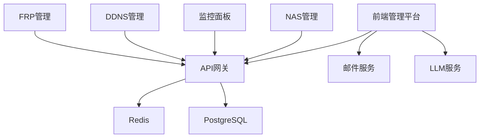

# YYC³ 快速启动指南

<div align="center">


> **言启象限 | 语枢未来**
> 
> **Words Initiate Quadrants, Language Serves as Core for the Future**

[](https://github.com/YYC-Cube/YYC3-NAS-ECS)
[](../LICENSE)
[](#快速启动)
[](https://www.docker.com/)
[](https://nodejs.org/)
[](../.trae/rules/project_rules.md)

**万象归元于云枢 | 深栈智启新纪元**
**All things converge in the cloud pivot; Deep stacks ignite a new era of intelligence**

[快速启动](#快速启动) • [前置要求](#前置要求) • [访问地址](#访问地址) • [服务管理](#服务管理) • [故障排查](#故障排查)

</div>

---

## 📋 目录

- [概述](#概述)
- [前置要求](#前置要求)
- [快速启动](#快速启动)
- [访问地址](#访问地址)
- [服务管理](#服务管理)
- [环境配置](#环境配置)
- [故障排查](#故障排查)
- [备份与恢复](#备份与恢复)
- [开发指南](#开发指南)
- [安全注意事项](#安全注意事项)
- [常见问题](#常见问题)
- [联系支持](#联系支持)

---

## 🎯 概述

YYC³ 企业管理平台快速启动指南提供了一套完整的服务启动和管理解决方案。通过统一的脚本和配置，开发者可以快速搭建开发环境、部署生产服务，并实现服务的自动化管理。

### 核心特性

- ✅ **一键启动**: 统一的启动脚本，快速启动所有服务
- ✅ **健康检查**: 自动化的服务健康检查机制
- ✅ **日志管理**: 集中的日志收集和查看
- ✅ **环境隔离**: 开发/生产环境配置分离
- ✅ **故障恢复**: 完善的备份和恢复机制
- ✅ **安全加固**: 多层次的安全防护措施

### 架构概览

```
┌─────────────────────────────────────────────────────────────┐
│                        YYC³ 企业管理平台                        │
├─────────────────────────────────────────────────────────────┤
│  前端管理平台 (6001)  │  API网关 (6000)  │  邮件服务 (6003)   │
├─────────────────────────────────────────────────────────────┤
│  LLM服务 (6002)      │  Redis (6379)   │  PostgreSQL (5432) │
├─────────────────────────────────────────────────────────────┤
│  NAS管理             │  监控面板       │  DDNS管理          │
├─────────────────────────────────────────────────────────────┤
│  FRP内网穿透         │  日志收集       │  备份恢复          │
└─────────────────────────────────────────────────────────────┘
```

---

## 📦 前置要求

### 系统要求

| 组件 | 版本要求 | 用途 |
|-----|---------|------|
| **操作系统** | Linux / macOS / Windows | 运行环境 |
| **Docker** | 20.10+ | 容器化平台 |
| **Docker Compose** | 2.0+ | 服务编排 |
| **Node.js** | 18.0+ | 前端运行时 |
| **Python** | 3.8+ | 后端运行时 |
| **Bun** | 1.0+ (推荐) | 前端构建工具 |
| **Git** | 2.30+ | 版本控制 |

### 安装检查

```bash
# 检查Docker
docker --version
docker-compose --version

# 检查Node.js
node --version

# 检查Python
python3 --version

# 检查Bun
bun --version

# 检查Git
git --version
```

### 权限配置

```bash
# 将用户添加到docker组（避免使用sudo）
sudo usermod -aG docker $USER

# 重新登录或运行
newgrp docker

# 验证权限
docker ps
```

---

## 🚀 快速启动

### 开发环境一键启动

<div align="center">

```bash
# 启动所有服务
./scripts/quick-start.sh

# 停止所有服务
./scripts/quick-stop.sh

# 重启所有服务
./scripts/quick-restart.sh
```

</div>

### 健康检查

<div align="center">

```bash
# 检查所有服务状态
./scripts/health-check.sh
```

</div>

### 启动流程


### 启动脚本详解

#### quick-start.sh

```bash
#!/bin/bash

# YYC³ 快速启动脚本
# 启动所有必需的服务

set -e

echo "🚀 YYC³ 快速启动..."
echo "=================="

# 检查Docker状态
if ! docker info > /dev/null 2>&1; then
    echo "❌ Docker未运行，请先启动Docker"
    exit 1
fi

# 启动Redis服务
echo "📦 启动Redis服务..."
cd redis
docker-compose -f config/docker-compose.yml up -d redis-dev
cd ..

# 启动API服务
echo "📦 启动API服务..."
cd api
docker-compose up -d api
cd ..

# 启动邮件服务
echo "📦 启动邮件服务..."
cd mail
nohup node server.js > logs/mail.log 2>&1 &
echo $! > logs/mail.pid
cd ..

# 启动LLM服务
echo "📦 启动LLM服务..."
cd llm
nohup uvicorn main:app --host 0.0.0.0 --port 6002 > logs/llm.log 2>&1 &
echo $! > logs/llm.pid
cd ..

# 启动FRP服务
echo "📦 启动FRP服务..."
cd frp
nohup ./frpc -c frpc.toml > logs/frpc.log 2>&1 &
echo $! > logs/frpc.pid
cd ..

# 启动前端服务
echo "📦 启动前端服务..."
cd frontend
bun run dev > ../logs/frontend.log 2>&1 &
echo $! > ../logs/frontend.pid
cd ..

# 等待服务启动
echo "⏳ 等待服务启动..."
sleep 10

# 健康检查
echo "🔍 执行健康检查..."
./scripts/health-check.sh

echo "✅ 所有服务启动完成！"
echo "📖 访问地址："
echo "   前端管理平台: http://localhost:6001"
echo "   API网关: http://localhost:6000"
echo "   API文档: http://localhost:6000/api/v2/docs"
```

#### health-check.sh

```bash
#!/bin/bash

# YYC³ 健康检查脚本
# 检查所有服务的运行状态

echo "🔍 YYC³ 健康检查..."
echo "=================="

# 检查Redis服务
echo -n "Redis服务: "
if docker ps | grep -q "redis-dev"; then
    echo "✅ 运行中"
else
    echo "❌ 未运行"
fi

# 检查API服务
echo -n "API服务: "
if docker ps | grep -q "api"; then
    echo "✅ 运行中"
else
    echo "❌ 未运行"
fi

# 检查邮件服务
echo -n "邮件服务: "
if [ -f mail/logs/mail.pid ] && kill -0 $(cat mail/logs/mail.pid) 2>/dev/null; then
    echo "✅ 运行中"
else
    echo "❌ 未运行"
fi

# 检查LLM服务
echo -n "LLM服务: "
if [ -f llm/logs/llm.pid ] && kill -0 $(cat llm/logs/llm.pid) 2>/dev/null; then
    echo "✅ 运行中"
else
    echo "❌ 未运行"
fi

# 检查FRP服务
echo -n "FRP服务: "
if [ -f frp/logs/frpc.pid ] && kill -0 $(cat frp/logs/frpc.pid) 2>/dev/null; then
    echo "✅ 运行中"
else
    echo "❌ 未运行"
fi

# 检查前端服务
echo -n "前端服务: "
if [ -f logs/frontend.pid ] && kill -0 $(cat logs/frontend.pid) 2>/dev/null; then
    echo "✅ 运行中"
else
    echo "❌ 未运行"
fi

echo "=================="
echo "✅ 健康检查完成"
```

---

## 🌐 访问地址

### 本地访问

<div align="center">

| 服务 | 地址 | 说明 | 状态 |
|-----|------|------|------|
| **前端管理平台** | <http://localhost:6001> | 主界面 | 🟢 |
| **API网关** | <http://localhost:6000> | 后端API | 🟢 |
| **API文档** | <http://localhost:6000/api/v2/docs> | Swagger文档 | 🟢 |
| **邮件服务** | <http://localhost:6003> | 邮件管理 | 🟢 |
| **LLM服务** | <http://localhost:6002> | AI助手 | 🟢 |
| **Redis** | localhost:6379 | 缓存数据库 | 🟢 |

</div>

### 公网访问（通过FRP）

<div align="center">

| 服务 | 地址 | 说明 | 状态 |
|-----|------|------|------|
| **管理平台** | <https://admin.0379.email> | 主界面 | 🟢 |
| **API服务** | <https://api.0379.email> | 后端API | 🟢 |
| **邮件服务** | <https://mail.0379.email> | 邮件管理 | 🟢 |
| **LLM服务** | <https://llm.0379.email> | AI助手 | 🟢 |
| **NAS管理** | <https://nas.0379.email> | 存储管理 | 🟢 |
| **监控面板** | <https://monitor.0379.email> | 系统监控 | 🟢 |
| **DDNS管理** | <https://ddns.0379.email> | 动态DNS | 🟢 |
| **FRP管理** | <http://frp.0379.email:7500> | FRP控制台 | 🟢 |

</div>

### 服务依赖关系



---

## 🔧 服务管理

### 查看日志

<div align="center">

```bash
# 查看所有日志
tail -f logs/*.log

# 查看特定服务日志
tail -f logs/llm.log      # LLM服务
tail -f logs/mail.log     # 邮件服务
tail -f logs/frontend.log # 前端服务

# 查看Docker日志
docker-compose -f api/docker-compose.yml logs -f api
docker-compose -f redis/config/docker-compose.yml logs -f redis-dev
```

</div>

### 日志级别

| 级别 | 说明 | 用途 |
|-----|------|------|
| **DEBUG** | 调试信息 | 开发调试 |
| **INFO** | 一般信息 | 正常运行 |
| **WARNING** | 警告信息 | 潜在问题 |
| **ERROR** | 错误信息 | 运行错误 |
| **CRITICAL** | 严重错误 | 系统故障 |

### 单独管理服务

#### API服务

<div align="center">

```bash
cd api

# 启动
docker-compose up -d api

# 停止
docker-compose stop api

# 查看日志
docker-compose logs -f api

# 重启
docker-compose restart api

# 查看状态
docker-compose ps api
```

</div>

#### Redis服务

<div align="center">

```bash
cd redis

# 启动
docker-compose -f config/docker-compose.yml up -d redis-dev

# 停止
docker-compose -f config/docker-compose.yml stop redis-dev

# 查看日志
docker-compose -f config/docker-compose.yml logs -f redis-dev

# 重启
docker-compose -f config/docker-compose.yml restart redis-dev

# 查看状态
docker-compose -f config/docker-compose.yml ps redis-dev
```

</div>

#### LLM服务

<div align="center">

```bash
cd llm

# 启动
nohup uvicorn main:app --host 0.0.0.0 --port 6002 > logs/llm.log 2>&1 &
echo $! > logs/llm.pid

# 停止
kill $(cat logs/llm.pid)

# 查看日志
tail -f logs/llm.log

# 查看状态
ps -p $(cat logs/llm.pid)
```

</div>

#### 邮件服务

<div align="center">

```bash
cd mail

# 启动
nohup node server.js > logs/mail.log 2>&1 &
echo $! > logs/mail.pid

# 停止
kill $(cat logs/mail.pid)

# 查看日志
tail -f logs/mail.log

# 查看状态
ps -p $(cat logs/mail.pid)
```

</div>

#### FRP客户端

<div align="center">

```bash
cd frp

# 启动
nohup ./frpc -c frpc.toml > logs/frpc.log 2>&1 &
echo $! > logs/frpc.pid

# 停止
kill $(cat logs/frpc.pid)

# 查看日志
tail -f logs/frpc.log

# 测试连接
curl http://frp.0379.email:7500
```

</div>

### 批量管理

<div align="center">

```bash
# 启动所有Docker服务
docker-compose -f api/docker-compose.yml up -d
docker-compose -f redis/config/docker-compose.yml up -d

# 停止所有Docker服务
docker-compose -f api/docker-compose.yml stop
docker-compose -f redis/config/docker-compose.yml stop

# 重启所有Docker服务
docker-compose -f api/docker-compose.yml restart
docker-compose -f redis/config/docker-compose.yml restart

# 查看所有Docker服务状态
docker-compose -f api/docker-compose.yml ps
docker-compose -f redis/config/docker-compose.yml ps
```

</div>

---

## ⚙️ 环境配置

### 开发环境

<div align="center">

```bash
# 开发环境自动使用以下配置
export VITE_API_BASE_URL=http://localhost:6000
export VITE_MAIL_API_URL=http://localhost:6003
export VITE_LLM_API_URL=http://localhost:6002
export VITE_ENABLE_MOCK_DATA=true
export VITE_ENABLE_DEBUG=true
```

</div>

### 生产环境

<div align="center">

```bash
# 生产环境使用以下配置
export VITE_API_BASE_URL=https://api.0379.email
export VITE_MAIL_API_URL=https://mail.0379.email
export VITE_LLM_API_URL=https://llm.0379.email
export VITE_ENABLE_MOCK_DATA=false
export VITE_ENABLE_DEBUG=false
```

</div>

### 环境变量文件

| 文件 | 用途 | 优先级 |
|-----|------|--------|
| `.env` | 默认配置 | 低 |
| `.env.local` | 本地覆盖 | 中 |
| `.env.development` | 开发环境 | 中 |
| `.env.production` | 生产环境 | 中 |
| `.env.*.local` | 特定环境本地覆盖 | 高 |

### 配置示例

```bash
# API配置
VITE_API_BASE_URL=http://localhost:6000
VITE_API_TIMEOUT=30000

# 邮件服务配置
VITE_MAIL_API_URL=http://localhost:6003
VITE_MAIL_API_TIMEOUT=10000

# LLM服务配置
VITE_LLM_API_URL=http://localhost:6002
VITE_LLM_MODEL=gpt-4
VITE_LLM_MAX_TOKENS=2048

# 功能开关
VITE_ENABLE_MOCK_DATA=true
VITE_ENABLE_DEBUG=true
VITE_ENABLE_ANALYTICS=false

# 其他配置
VITE_APP_TITLE=YYC³ 企业管理平台
VITE_APP_VERSION=1.0.0
```

---

## 🔍 故障排查

### 服务无法启动

#### 1. 检查端口占用

<div align="center">

```bash
netstat -tlnp | grep 600
lsof -i :6000
lsof -i :6001
lsof -i :6002
lsof -i :6003
```

</div>

#### 2. 查看详细日志

<div align="center">

```bash
tail -f logs/*.log
tail -n 100 logs/llm.log
tail -n 100 logs/mail.log
tail -n 100 logs/frontend.log
```

</div>

#### 3. 检查Docker状态

<div align="center">

```bash
docker ps -a
docker images
docker network ls
docker volume ls
```

</div>

#### 4. 检查系统资源

<div align="center">

```bash
# CPU使用率
top -bn1 | grep "Cpu(s)"

# 内存使用
free -h

# 磁盘使用
df -h

# Docker资源
docker stats
```

</div>

### FRP连接失败

#### 1. 检查网络连接

<div align="center">

```bash
ping 8.152.195.33
traceroute 8.152.195.33
```

</div>

#### 2. 验证FRP服务器

<div align="center">

```bash
curl http://frp.0379.email:7500
# 用户名: yyc3
# 密码: my151001
```

</div>

#### 3. 检查frpc配置

<div align="center">

```bash
cat frp/frpc.toml
```

</div>

#### 4. 查看FRP日志

<div align="center">

```bash
tail -f frp/logs/frpc.log
```

</div>

### DDNS不更新

#### 1. 检查DDNS服务状态

<div align="center">

```bash
sudo systemctl status yyc3-ddns.timer
sudo systemctl status yyc3-ddns.service
```

</div>

#### 2. 查看DDNS日志

<div align="center">

```bash
tail -f /opt/yyc3/logs/ddns/ddns-*.log
```

</div>

#### 3. 手动测试DDNS更新

<div align="center">

```bash
bash /opt/yyc3/ddns/aliyun-ddns.sh
```

</div>

#### 4. 检查定时任务

<div align="center">

```bash
sudo systemctl list-timers yyc3-ddns.timer
```

</div>

### 前端无法访问

#### 1. 检查前端服务状态

<div align="center">

```bash
curl http://localhost:6001
curl -I http://localhost:6001
```

</div>

#### 2. 检查浏览器控制台错误

打开浏览器开发者工具（F12），查看Console和Network标签页的错误信息。

#### 3. 清除浏览器缓存

<div align="center">

```bash
# Chrome/Edge
Ctrl + Shift + Delete

# Firefox
Ctrl + Shift + Delete

# Safari
Cmd + Option + E
```

</div>

#### 4. 检查构建文件

<div align="center">

```bash
ls -la frontend/dist/
ls -la frontend/.vite/
```

</div>

### 数据库连接失败

#### 1. 检查数据库服务

<div align="center">

```bash
# 检查PostgreSQL
docker ps | grep postgres

# 检查Redis
docker ps | grep redis
```

</div>

#### 2. 测试数据库连接

<div align="center">

```bash
# PostgreSQL
docker exec -it nas-ddns-postgres psql -U nas_admin -d nas_ddns

# Redis
docker exec -it redis-dev redis-cli
```

</div>

#### 3. 检查连接配置

<div align="center">

```bash
cat .env | grep DB_
cat .env | grep REDIS_
```

</div>

---

## 💾 备份与恢复

### 手动备份

<div align="center">

```bash
# 备份配置文件
tar -czf backup_$(date +%Y%m%d).tar.gz \
  config/ \
  frp/frpc.toml \
  frp/frps.toml \
  .env.local \
  .env.*.local

# 备份数据库
docker exec nas-ddns-postgres pg_dump -U nas_admin nas_ddns > backup_db_$(date +%Y%m%d).sql

# 备份Redis数据
docker exec redis-dev redis-cli BGSAVE
docker cp redis-dev:/data/dump.rdb redis_backup_$(date +%Y%m%d).rdb
```

</div>

### 自动备份

创建定时任务：

<div align="center">

```bash
# 编辑crontab
crontab -e

# 添加定时备份任务（每天凌晨2点）
0 2 * * * /path/to/backup.sh >> /var/log/backup.log 2>&1
```

</div>

backup.sh脚本：

<div align="center">

```bash
#!/bin/bash

# YYC³ 自动备份脚本

BACKUP_DIR="/opt/yyc3/backups"
DATE=$(date +%Y%m%d_%H%M%S)

# 创建备份目录
mkdir -p $BACKUP_DIR

# 备份配置文件
tar -czf $BACKUP_DIR/config_$DATE.tar.gz \
  /opt/yyc3/config/ \
  /opt/yyc3/frp/frpc.toml \
  /opt/yyc3/frp/frps.toml \
  /opt/yyc3/.env.local

# 备份数据库
docker exec nas-ddns-postgres pg_dump -U nas_admin nas_ddns > $BACKUP_DIR/db_$DATE.sql

# 备份Redis数据
docker exec redis-dev redis-cli BGSAVE
sleep 5
docker cp redis-dev:/data/dump.rdb $BACKUP_DIR/redis_$DATE.rdb

# 清理旧备份（保留最近30天）
find $BACKUP_DIR -name "*.tar.gz" -mtime +30 -delete
find $BACKUP_DIR -name "*.sql" -mtime +30 -delete
find $BACKUP_DIR -name "*.rdb" -mtime +30 -delete

echo "Backup completed: $DATE"
```

</div>

### 恢复

<div align="center">

```bash
# 恢复配置文件
tar -xzf backup_20250105.tar.gz -C /

# 恢复数据库
docker exec -i nas-ddns-postgres psql -U nas_admin nas_ddns < backup_db_20250105.sql

# 恢复Redis数据
docker cp redis_backup_20250105.rdb redis-dev:/data/dump.rdb
docker restart redis-dev
```

</div>

---

## 📚 开发指南

### 前端开发

<div align="center">

```bash
# 进入前端目录
cd frontend

# 安装依赖
bun install

# 启动开发服务器
bun run dev

# 构建生产版本
bun run build:prod

# 预览生产版本
bun run preview:prod

# 代码检查
bun run lint

# 类型检查
bun run type-check
```

</div>

### API开发

<div align="center">

```bash
# 进入API目录
cd api

# 启动API开发服务器
docker-compose up -d api

# 查看API文档
# 访问: http://localhost:6000/api/v2/docs

# 运行测试
docker-compose run api pytest

# 运行测试并生成覆盖率报告
docker-compose run api pytest --cov=app --cov-report=html

# 代码格式化
docker-compose run api black app/

# 类型检查
docker-compose run api mypy app/
```

</div>

### 添加新服务

#### 步骤1: 创建配置文件

在 `config/` 目录创建配置文件：

<div align="center">

```bash
# 示例: config/new-service.config.js
module.exports = {
  name: 'new-service',
  port: 6006,
  env: {
    NODE_ENV: 'development',
    LOG_LEVEL: 'debug'
  }
};
```

</div>

#### 步骤2: 添加服务定义

在 `docker-compose.yml` 添加服务定义：

<div align="center">

```yaml
services:
  new-service:
    build:
      context: ./new-service
      dockerfile: Dockerfile
    container_name: yyc3-new-service
    ports:
      - "6006:6006"
    environment:
      - NODE_ENV=development
    volumes:
      - ./new-service:/app
      - ./logs:/app/logs
    networks:
      - yyc3-network
    restart: unless-stopped
```

</div>

#### 步骤3: 添加启动逻辑

在 `scripts/stack-manager.sh` 添加启动逻辑：

<div align="center">

```bash
start_new_service() {
    echo "🚀 启动新服务..."
    cd new-service
    nohup node server.js > logs/new-service.log 2>&1 &
    echo $! > logs/new-service.pid
    cd ..
}
```

</div>

#### 步骤4: 添加前端组件

在前端添加对应组件：

<div align="center">

```typescript
// src/components/NewServiceWidget.tsx
import React, { useState, useEffect } from 'react';

export const NewServiceWidget: React.FC = () => {
  const [status, setStatus] = useState<'loading' | 'success' | 'error'>('loading');
  const [data, setData] = useState<any>(null);

  useEffect(() => {
    fetch('http://localhost:6006/api/status')
      .then(res => res.json())
      .then(data => {
        setData(data);
        setStatus('success');
      })
      .catch(() => setStatus('error'));
  }, []);

  return (
    <div className="new-service-widget">
      <h3>新服务</h3>
      {status === 'loading' && <p>加载中...</p>}
      {status === 'success' && <pre>{JSON.stringify(data, null, 2)}</pre>}
      {status === 'error' && <p>加载失败</p>}
    </div>
  );
};
```

</div>

---

## 🔒 安全注意事项

### 1. 不要提交敏感信息到Git

<div align="center">

```bash
# 确保.gitignore忽略所有.env和密钥文件
echo ".env" >> .gitignore
echo "*.key" >> .gitignore
echo "*.pem" >> .gitignore
echo "secrets/" >> .gitignore

# 移除已提交的敏感文件
git rm --cached .env
git rm --cached secrets/
git commit -m "Remove sensitive files"
```

</div>

### 2. 定期更换密码

<div align="center">

| 密码类型 | 更换频率 | 长度要求 |
|---------|---------|---------|
| **FRP管理面板** | 每月 | 12+字符 |
| **数据库密码** | 每季度 | 16+字符 |
| **API密钥** | 每季度 | 32+字符 |
| **系统用户密码** | 每季度 | 12+字符 |

</div>

### 3. 启用HTTPS

<div align="center">

```bash
# 使用Let's Encrypt获取免费SSL证书
sudo certbot certonly --standalone -d admin.0379.email

# 配置Nginx使用SSL证书
server {
    listen 443 ssl http2;
    server_name admin.0379.email;

    ssl_certificate /etc/letsencrypt/live/admin.0379.email/fullchain.pem;
    ssl_certificate_key /etc/letsencrypt/live/admin.0379.email/privkey.pem;

    # 强制HTTPS
    add_header Strict-Transport-Security "max-age=31536000" always;
}
```

</div>

### 4. 限制访问

<div align="center">

```bash
# 配置防火墙规则
sudo ufw allow 22/tcp    # SSH
sudo ufw allow 80/tcp    # HTTP
sudo ufw allow 443/tcp   # HTTPS
sudo ufw enable

# 使用VPN或内网访问管理界面
# 配置WireGuard VPN
# 或使用SSH隧道
ssh -L 6000:localhost:6000 user@server
```

</div>

### 5. 日志监控

<div align="center">

```bash
# 监控错误日志
tail -f logs/*.log | grep ERROR

# 设置日志轮转
sudo nano /etc/logrotate.d/yyc3

# 配置示例
/opt/yyc3/logs/*.log {
    daily
    rotate 30
    compress
    delaycompress
    missingok
    notifempty
    create 0644 yyc3 yyc3
}
```

</div>

---

## ❓ 常见问题

<div align="center">

### Q: 端口被占用怎么办？

**A:** 修改 `.env.ports` 文件中的端口配置，然后重启服务。

```bash
# 查看端口占用
lsof -i :6000

# 修改端口配置
nano .env.ports

# 重启服务
./scripts/quick-restart.sh
```

---

### Q: 如何查看服务日志？

**A:** 使用 `tail -f logs/*.log` 查看所有日志，或查看特定服务日志。

```bash
# 查看所有日志
tail -f logs/*.log

# 查看特定服务日志
tail -f logs/llm.log
tail -f logs/mail.log
tail -f logs/frontend.log

# 查看Docker日志
docker-compose -f api/docker-compose.yml logs -f api
```

---

### Q: FRP连接不稳定怎么办？

**A:** 检查网络连接，确认frpc和frps版本一致，查看frpc日志。

```bash
# 检查网络连接
ping 8.152.195.33

# 检查FRP版本
./frp/frpc -v

# 查看FRP日志
tail -f frp/logs/frpc.log

# 重启FRP服务
kill $(cat frp/logs/frpc.pid)
cd frp
nohup ./frpc -c frpc.toml > logs/frpc.log 2>&1 &
echo $! > logs/frpc.pid
```

---

### Q: 如何升级服务？

**A:** 停止服务，拉取最新代码，重新构建镜像，启动服务。

```bash
# 停止服务
./scripts/quick-stop.sh

# 拉取最新代码
git pull origin main

# 重新构建镜像
cd api
docker-compose build api
cd ..

# 启动服务
./scripts/quick-start.sh
```

---

### Q: 如何重置数据库？

**A:** 备份数据，删除数据库容器，重新创建容器，恢复数据。

```bash
# 备份数据
docker exec nas-ddns-postgres pg_dump -U nas_admin nas_ddns > backup.sql

# 停止并删除容器
docker-compose -f api/docker-compose.yml stop postgres
docker-compose -f api/docker-compose.yml rm -f postgres

# 重新创建容器
docker-compose -f api/docker-compose.yml up -d postgres

# 恢复数据
docker exec -i nas-ddns-postgres psql -U nas_admin nas_ddns < backup.sql
```

---

### Q: 如何清理Docker资源？

**A:** 使用Docker清理命令释放磁盘空间。

```bash
# 清理未使用的镜像
docker image prune -a

# 清理未使用的容器
docker container prune

# 清理未使用的卷
docker volume prune

# 清理未使用的网络
docker network prune

# 清理所有未使用的资源
docker system prune -a --volumes
```

---

### Q: 如何查看服务性能？

**A:** 使用Docker stats和系统监控工具。

```bash
# 查看Docker容器资源使用
docker stats

# 查看系统资源
top
htop

# 查看磁盘使用
df -h

# 查看网络连接
netstat -tunlp
```

---

### Q: 如何配置邮件服务？

**A:** 修改邮件服务配置文件，设置SMTP服务器信息。

```bash
# 编辑邮件服务配置
nano mail/config.js

# 配置示例
module.exports = {
  smtp: {
    host: 'smtp.example.com',
    port: 587,
    secure: false,
    auth: {
      user: 'your-email@example.com',
      pass: 'your-password'
    }
  }
};

# 重启邮件服务
kill $(cat mail/logs/mail.pid)
cd mail
nohup node server.js > logs/mail.log 2>&1 &
echo $! > logs/mail.pid
```

---

### Q: 如何配置LLM服务？

**A:** 修改LLM服务配置文件，设置API密钥和模型参数。

```bash
# 编辑LLM服务配置
nano llm/config.py

# 配置示例
OPENAI_API_KEY = 'your-api-key'
OPENAI_MODEL = 'gpt-4'
MAX_TOKENS = 2048
TEMPERATURE = 0.7

# 重启LLM服务
kill $(cat llm/logs/llm.pid)
cd llm
nohup uvicorn main:app --host 0.0.0.0 --port 6002 > logs/llm.log 2>&1 &
echo $! > logs/llm.pid
```

</div>

---

## 📞 联系支持

### 文档资源

- **项目文档**: [YYC³ 文档中心](../README.md)
- **API文档**: [API参考文档](../YYC3-NAS-API文档/)
- **开发指南**: [开发指导](../YYC3-NAS-开发指导/开发指导.md)
- **架构设计**: [架构文档](../YYC3-NAS-架构设计/)

### 技术支持

- **问题反馈**: 提交 [GitHub Issue](https://github.com/YYC-Cube/YYC3-NAS-ECS/issues)
- **功能建议**: 提交 [Feature Request](https://github.com/YYC-Cube/YYC3-NAS-ECS/issues/new?template=feature_request.md)
- **安全问题**: 发送邮件至 [admin@0379.email](mailto:admin@0379.email)

### 社区资源

- **官方网站**: [https://yyc3.0379.email](https://yyc3.0379.email)
- **GitHub仓库**: [https://github.com/YYC-Cube/YYC3-NAS-ECS](https://github.com/YYC-Cube/YYC3-NAS-ECS)
- **文档中心**: [https://docs.yyc3.0379.email](https://docs.yyc3.0379.email)

---

## 📝 更新日志

### v1.0.0 (2026-01-05)

- ✅ 初始版本发布
- ✅ 添加快速启动脚本
- ✅ 实现健康检查机制
- ✅ 完善日志管理系统
- ✅ 添加备份恢复功能
- ✅ 完善故障排查指南
- ✅ 添加安全注意事项
- ✅ 完善常见问题解答

---

<div align="center">

> **言启象限 | 语枢未来**
> 
> **Words Initiate Quadrants, Language Serves as Core for the Future**

[](https://github.com/YYC-Cube/YYC3-NAS-ECS)
[](../LICENSE)
[](../.trae/rules/project_rules.md)

**万象归元于云枢 | 深栈智启新纪元**
**All things converge in the cloud pivot; Deep stacks ignite a new era of intelligence**

</div>