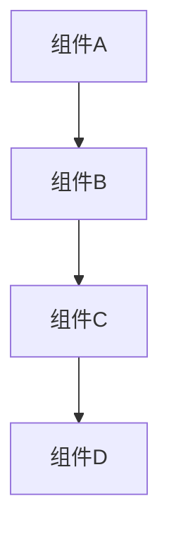
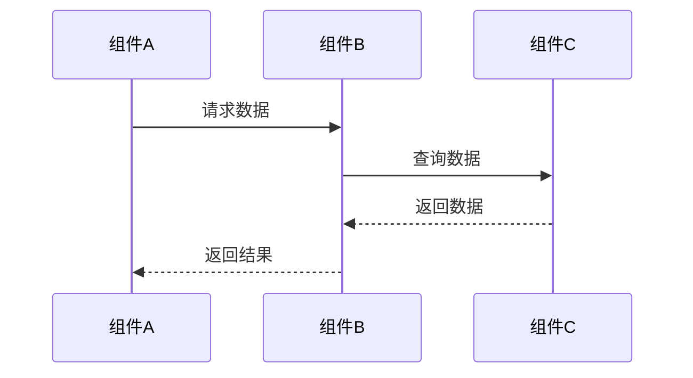

# [技术文档标题]

> ***YanYuCloudCube***
> 言启象限 | 语枢未来
> ***Words Initiate Quadrants, Language Serves as Core for the Future***
> 万象归元于云枢 | 深栈智启新纪元
> ***All things converge in the cloud pivot; Deep stacks ignite a new era of intelligence***

---

> **文档编号**: YYC3-NAS-ECS-TECH-[编号]
> **创建日期**: YYYY-MM-DD
> **版本**: 1.0.0
> **作者**: YYC³ Team
> **更新日期**: YYYY-MM-DD

---

## 📋 概述

[技术文档概述，简要描述技术内容、适用范围和目标读者]

---

## 🎯 技术目标

[列出技术文档要达成的目标]

---

## 🏗️ 架构设计

### 系统架构

[描述系统架构设计]



### 模块划分

[描述模块划分和职责]

| 模块 | 职责 | 依赖 |
|------|------|------|
| 模块A | 职责描述 | 依赖列表 |
| 模块B | 职责描述 | 依赖列表 |

---

## 🔧 技术实现

### 核心功能

[描述核心功能实现]

```typescript
/**
 * @file [文件名]
 * @description [文件描述]
 * @module [模块名]
 * @author YYC³
 * @version 1.0.0
 * @created YYYY-MM-DD
 */

import { Dependency } from '@/path/to/dependency';

/**
 * [函数/类描述]
 * @param [参数名] - [参数描述]
 * @returns [返回值描述]
 * @throws {Error} [错误描述]
 */
export function functionName(param: Type): ReturnType {
  // 实现代码
}
```

### 接口定义

[描述接口定义]

```typescript
/**
 * [接口描述]
 */
export interface InterfaceName {
  /** [属性描述] */
  property: Type;
  
  /** [方法描述] */
  method(param: Type): ReturnType;
}
```

### 类型定义

[描述类型定义]

```typescript
/**
 * [类型描述]
 */
export type TypeName = {
  property: Type;
};
```

---

## 📊 数据结构

### 数据模型

[描述数据模型]

```typescript
/**
 * [模型描述]
 */
export interface ModelName {
  /** [属性描述] */
  id: string;
  
  /** [属性描述] */
  name: string;
  
  /** [属性描述] */
  createdAt: Date;
}
```

### 数据流

[描述数据流向]



---

## 🔌 API 接口

### 接口列表

| 接口 | 方法 | 路径 | 描述 |
|------|------|------|------|
| 接口1 | GET | /api/endpoint1 | 描述 |
| 接口2 | POST | /api/endpoint2 | 描述 |

### 接口详情

#### [接口名称]

**请求**:
- 方法: `GET` / `POST` / `PUT` / `DELETE`
- 路径: `/api/endpoint`
- 请求头:
```typescript
{
  "Content-Type": "application/json",
  "Authorization": "Bearer {token}"
}
```
- 请求体:
```typescript
{
  "param1": "value1",
  "param2": "value2"
}
```

**响应**:
- 成功 (200):
```typescript
{
  "success": true,
  "data": {
    "id": "123",
    "name": "value"
  }
}
```
- 错误 (400):
```typescript
{
  "success": false,
  "error": "错误信息"
}
```

---

## ⚙️ 配置说明

### 环境变量

| 变量名 | 类型 | 默认值 | 描述 |
|--------|------|--------|------|
| ENV_VAR | string | "default" | 描述 |

### 配置文件

[描述配置文件结构]

```typescript
export interface Config {
  /** [配置项描述] */
  setting: Type;
  
  /** [配置项描述] */
  option: Type;
}
```

---

## 🧪 测试

### 单元测试

[描述单元测试]

```typescript
import { describe, it, expect } from 'vitest';
import { functionName } from './module';

describe('functionName', () => {
  it('应该正确执行', () => {
    const result = functionName(param);
    expect(result).toEqual(expected);
  });
});
```

### 集成测试

[描述集成测试]

```typescript
describe('集成测试', () => {
  it('应该正确集成', async () => {
    const result = await integrationTest();
    expect(result.success).toBe(true);
  });
});
```

---

## 📈 性能优化

### 性能指标

| 指标 | 目标值 | 当前值 | 状态 |
|--------|--------|--------|------|
| 响应时间 | < 200ms | 150ms | ✅ |
| 吞吐量 | > 1000/s | 1200/s | ✅ |

### 优化策略

[描述性能优化策略]

---

## 🔒 安全考虑

### 安全措施

[描述安全措施]

### 安全检查清单

- [ ] 输入验证
- [ ] 输出编码
- [ ] 认证授权
- [ ] 数据加密
- [ ] 错误处理

---

## 🐛 故障排除

### 常见问题

| 问题 | 原因 | 解决方案 |
|------|------|----------|
| 问题1 | 原因1 | 解决方案1 |
| 问题2 | 原因2 | 解决方案2 |

### 调试指南

[提供调试指南]

---

## 📚 参考资源

### YYC³标准

- [YYC³团队智能应用开发标准规范](file:///Users/yanyu/Downloads/YYC3-NAS-ECS/docs/YYC3-NAS-ECS-开发标准规范.md)
- [YYC³代码生成规范](file:///Users/yanyu/Downloads/YYC3-NAS-ECS/docs/YYC3-NAS-ECS-代码生成规范.md)

### 相关文档

- [相关技术文档1](file:///Users/yanyu/Downloads/YYC3-NAS-ECS/docs/相关技术文档1.md)
- [相关技术文档2](file:///Users/yanyu/Downloads/YYC3-NAS-ECS/docs/相关技术文档2.md)

### 外部资源

- [TypeScript官方文档](https://www.typescriptlang.org/docs/)
- [React官方文档](https://react.dev/)

---

## 📝 变更日志

### [版本号] - [日期]

#### 新增
- [新增功能1]
- [新增功能2]

#### 修改
- [修改内容1]
- [修改内容2]

#### 修复
- [修复问题1]
- [修复问题2]

#### 移除
- [移除功能1]

---

<div align="center">

> 「***YanYuCloudCube***」
> 「***<admin@0379.email>***」
> 「***Words Initiate Quadrants, Language Serves as Core for the Future***」
> 「***All things converge in the cloud pivot; Deep stacks ignite a new era of intelligence***」

</div>
