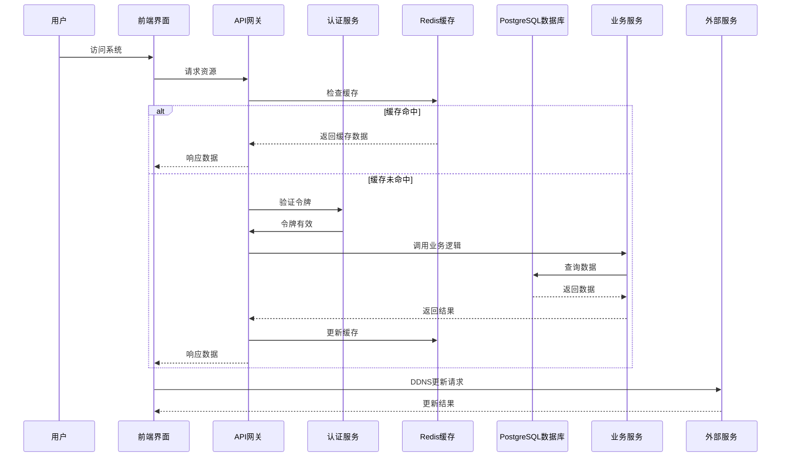
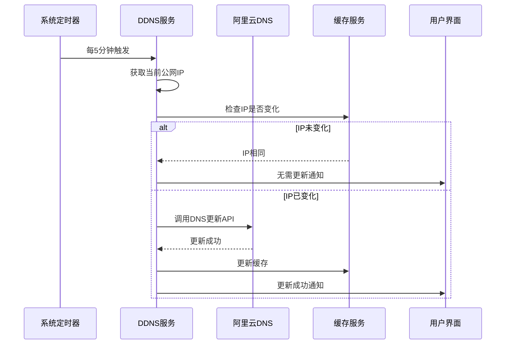
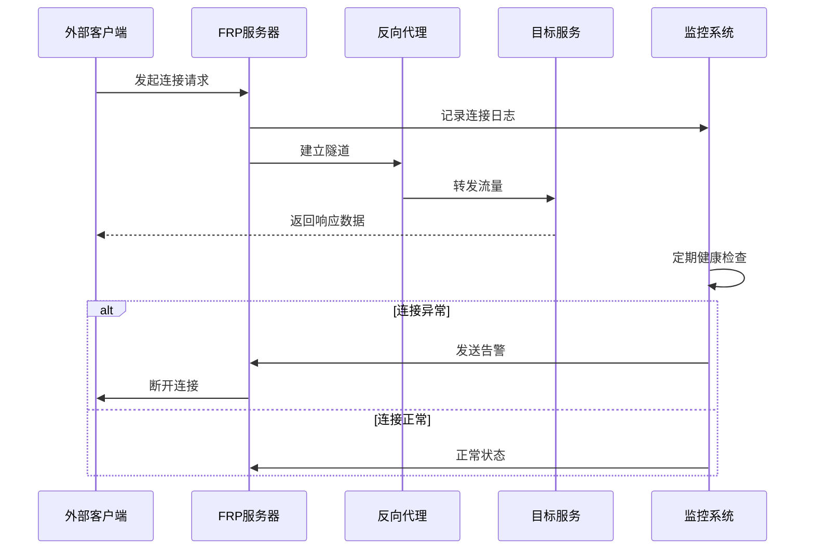
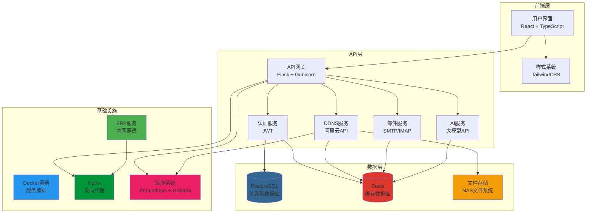
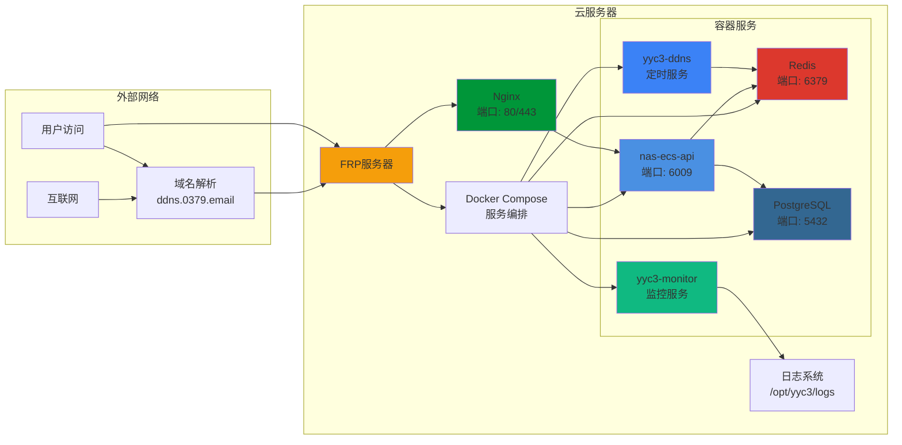
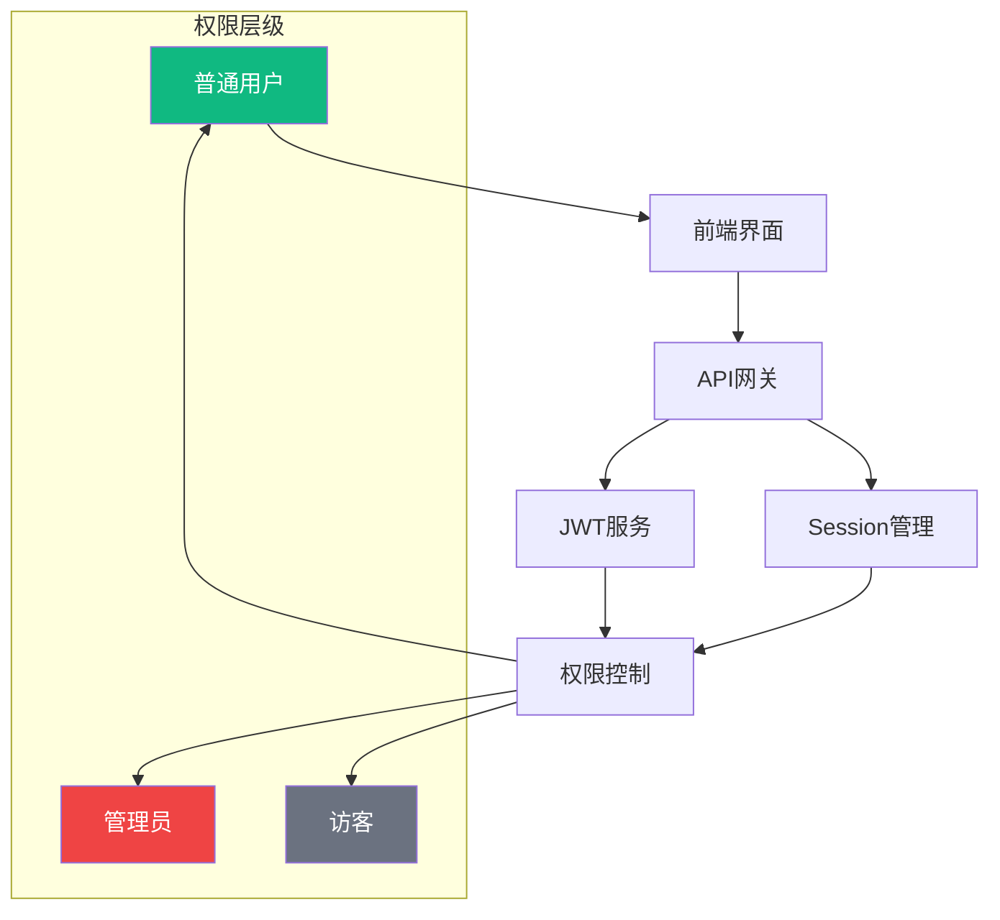
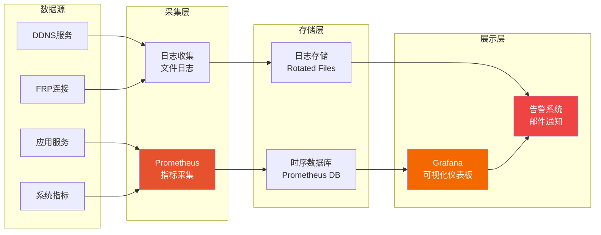
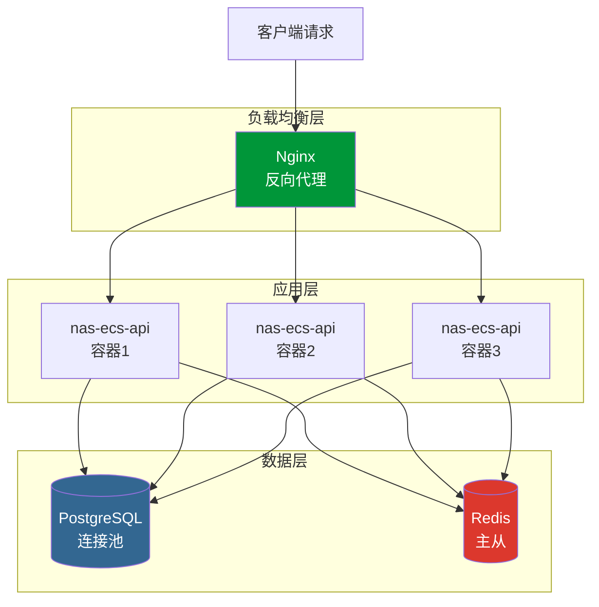

# YYC³ NAS-ECS 技术架构

> **言启象限 | 语枢未来**
> **Words Initiate Quadrants, Language Serves as Core for the Future**
> 万象归元于云枢 | 深栈智启新纪元
> **All things converge in the cloud pivot; Deep stacks ignite a new era of intelligence**

---

> **文档版本**: 1.0.0  
> **创建日期**: 2026-02-13  
> **作者**: YYC³ Team  
> **最后更新**: 2026-02-13  
> **分类**: 技术架构文档  

---

## 📋 目录

1. [系统架构概览](#系统架构概览)
2. [技术栈分层](#技术栈分层)
3. [数据流向](#数据流向)
4. [服务依赖关系](#服务依赖关系)
5. [部署架构](#部署架构)

---

## 系统架构概览

YYC³ NAS-ECS 采用微服务架构，各服务独立部署但通过API和消息总线协同工作。

```
┌─────────────────────────────────────────────────────────────────────────────┐
│                     YYC³ NAS-ECS 系统架构                      │
├─────────────────────────────────────────────────────────────────────────────┤
│                                                                  │
│  ┌──────────────┐  ┌──────────────┐  ┌──────────────┐  │
│  │  用户界面    │  │  API 网关   │  │  监控系统    │  │
│  │  (React)    │  │  (Flask)     │  │  (Prometheus) │  │
│  └──────┬───────┘  └──────┬───────┘  └──────┬───────┘  │
│         │                   │                   │             │
│         │                   │                   │             │
│  ┌──────▼──────┐  ┌──────▼───────────┐  ┌──────▼───────┐  │
│  │  业务服务层  │  │  微服务集群      │  │  告警通知    │  │
│  └──────┬───────┘  └──────┬───────────┘  └──────┬───────┘  │
│         │                   │                   │             │
│  ┌──────▼──────────────────────────────────────────────┐         │
│  │  数据层                                      │         │
│  └──────┬──────────────────────────────────────┬─────────┘         │
│         │                                      │                   │
│  ┌──────▼──────┐  ┌──────────────────▼──────┐      │
│  │ PostgreSQL  │  │  Redis                 │      │
│  └─────────────┘  └─────────────────────────┘      │
│                                                  │
└──────────────────────────────────────────────────────────────┘
```

---

## 技术栈分层

### 前端层 (Frontend Layer)

| 技术 | 版本 | 用途 | 说明 |
|------|------|------|------|
| React | 18.3.1 | UI 框架 | 组件化开发 |
| TypeScript | 5.x | 类型系统 | 类型安全 |
| Vite | 6.4 | 构建工具 | 快速热更新 |
| TailwindCSS | 3.x | 样式框架 | 原子化样式 |
| Zustand | 4.x | 状态管理 | 轻量级状态管理 |

### 后端层 (Backend Layer)

| 技术 | 版本 | 用途 | 说明 |
|------|------|------|------|
| Python | 3.11 | 编程语言 | 主要开发语言 |
| Flask | 2.x | Web 框架 | RESTful API |
| Gunicorn | 21.x | WSGI 服务器 | 生产服务器 |
| JWT | - | 认证 | 令牌认证 |

### 数据层 (Data Layer)

| 技术 | 版本 | 用途 | 说明 |
|------|------|------|------|
| PostgreSQL | 14 | 关系型数据库 | 持久化存储 |
| Redis | 7 | 缓存数据库 | 高速缓存 |
| SQLite | - | 轻量级存储 | 配置和临时数据 |

### 基础设施层 (Infrastructure Layer)

| 技术 | 版本 | 用途 | 说明 |
|------|------|------|------|
| Docker | 24+ | 容器化 | 服务容器化 |
| Nginx | 1.x | 反向代理 | 负载均衡 |
| FRP | 0.52+ | 内网穿透 | 远程访问 |
| Prometheus | - | 监控收集 | 指标采集 |
| Grafana | - | 可视化 | 监控仪表板 |

---

## 数据流向

### 用户请求流程



### DDNS 更新流程



### FRP 连接流程



---

## 服务依赖关系

### 核心服务依赖



---

## 部署架构

### 生产环境部署



### 网络拓扑

```
┌─────────────────────────────────────────────────────────────────────────┐
│                        互联网                                    │
└──────────────────────┬────────────────────────────────────────────────┘
                       │
        ┌──────────────▼──────────────┐
        │   DNS解析层              │
        │   ddns.0379.email        │
        └──────────────┬─────────────┘
                       │
        ┌──────────────▼──────────────┐
        │   内网穿透层              │
        │   frp.0379.email          │
        └──────────────┬─────────────┘
                       │
        ┌─────────────────────────────────────────────────────────┐
        │          云服务器 (8.152.195.33)               │
        ├─────────────────────────────────────────────────────────┤
        │                                                   │
        │  ┌─────────────┐  ┌─────────────┐  ┌───────┐  │
        │  │ Nginx      │  │ Docker      │  │ FRP   │  │
        │  │ :80/:443   │  │ Compose    │  │ Client │  │
        │  └──────┬─────┘  └──────┬──────┘  └───────┘  │
        │         │                   │                   │         │
        │  ┌──────▼──────────────────────────────────────┐  │
        │  │ 容器服务层                            │  │
        │  │                                        │  │
        │  │  ┌──────────┐  ┌──────────┐  ┌─────┐ │
        │  │  │ API      │  │ DDNS     │  │Redis │ │
        │  │  │ :6009     │  │ Timer    │  │:6379│ │
        │  │  └──────────┘  └──────────┘  └─────┘ │
        │  │                                        │  │
        │  └──────────────────────────────────────────────┘  │
        │                                             │
        └─────────────────────────────────────────────────────┘
```

---

## 安全架构

### 认证与授权



### 数据安全

| 安全措施 | 实现方式 | 保护范围 |
|----------|----------|----------|
| 数据加密 | PostgreSQL SSL + 传输加密 | 数据库连接 |
| 密码哈希 | bcrypt | 用户密码 |
| 会话安全 | JWT + HttpOnly Cookie | 用户会话 |
| API 鉴权 | Bearer Token + RBAC | API 访问 |
| 输入验证 | 参数校验 + SQL 注入防护 | 所有输入 |
| 敏感信息 | 占位符 + 环境变量 | 配置文件 |

---

## 监控架构

### 监控数据流



---

## 性能优化

### 缓存策略

| 缓存类型 | TTL | 存储内容 | 缓存方式 |
|----------|-----|----------|----------|
| Redis 会话缓存 | 24小时 | 用户会话数据 |
| Redis API 缓存 | 5分钟 | API 响应数据 |
| Redis DDNS 缓存 | 5分钟 | DNS 解析结果 |
| PostgreSQL 查询缓存 | 永久 | 热点数据索引 |

### 负载均衡



---

## 扩展性设计

### 水平扩展

- **无状态服务**: API 服务设计为无状态，可轻松水平扩展
- **容器化部署**: Docker Compose 支持快速扩容
- **负载均衡**: Nginx 支持多实例负载分发
- **数据库连接池**: PostgreSQL 连接池优化，支持高并发

### 垂直扩展

- **硬件升级**: 支持更多 CPU/内存配置
- **数据库优化**: 索引优化、查询优化
- **缓存分层**: Redis 多级缓存，减少数据库压力

---

<div align="center">

> **言启象限 | 语枢未来**
>
> **Words Initiate Quadrants, Language Serves as Core for the Future**
>
> 万象归元于云枢 | 深栈智启新纪元
>
> **All things converge in the cloud pivot; Deep stacks ignite a new era of intelligence**

</div>

---

**文档版本**: 1.0.0  
**最后更新**: 2026-02-13  
**维护者**: YYC³ Team  
**许可协议**: MIT
