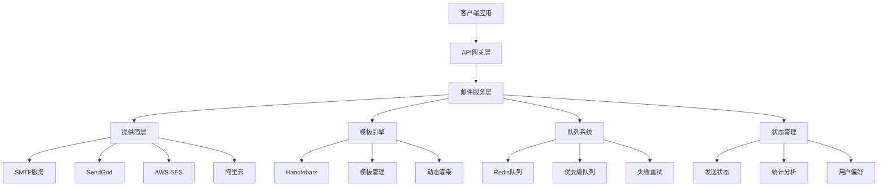
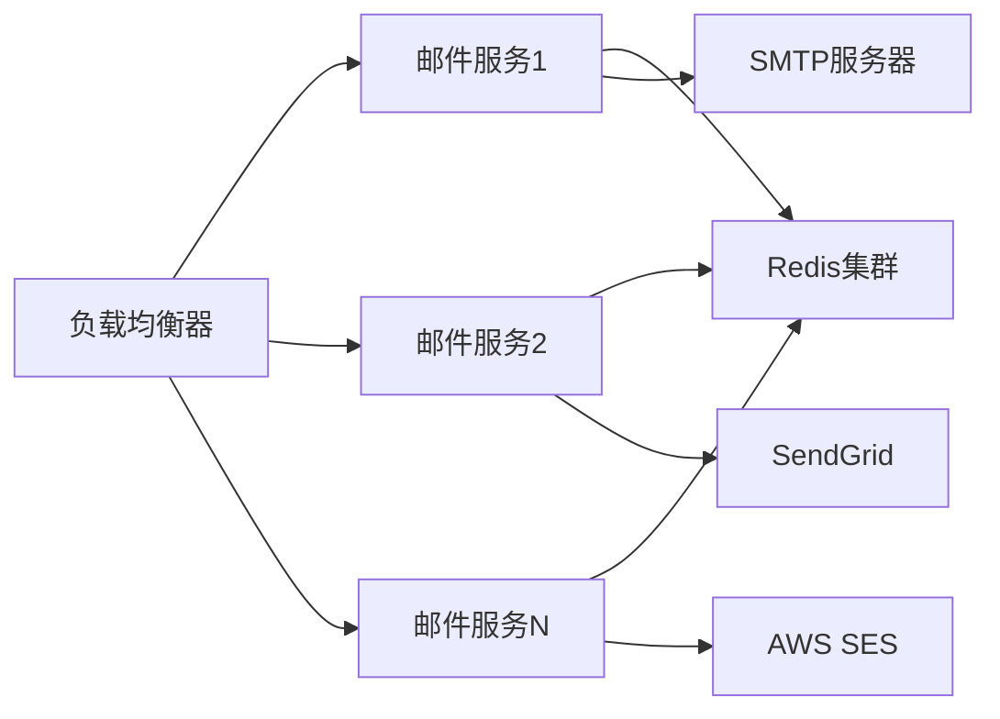

# YYC3 邮件服务开发规划路线图

> 📋 **文档版本**: v1.0.0 | **创建时间**: 2025-12-08 | **维护团队**: YYC3 AI Family

## 📖 项目概述

YYC3邮件服务是YYC3 AI Family平台的核心通信组件，提供统一、可靠的邮件发送能力，支持多种邮件提供商和高级邮件功能。

### 基本信息

- **服务名称**: YYC3 Mail Service
- **技术栈**: Node.js 18+ | Express.js | Nodemailer | Handlebars | Redis
- **服务端口**: 6603 (生产) / 3003 (开发)
- **主要功能**: 邮件发送、模板渲染、队列处理、状态跟踪

## 🎯 开发目标与愿景

### 核心目标

1. **统一邮件接口**: 为YYC3平台提供统一的邮件发送服务
2. **多提供商支持**: 支持SMTP、SendGrid、AWS SES、阿里云邮件推送
3. **模板引擎**: 支持动态邮件模板渲染和个性化
4. **队列处理**: 异步批量发送，提升系统性能
5. **发送状态跟踪**: 实时监控邮件发送状态和统计

### 技术愿景

- 构建企业级邮件服务基础设施
- 实现智能路由和负载均衡
- 提供可扩展的邮件能力框架
- 支持私有化部署和数据安全

## 🏗️ 技术架构规划

### 架构层次



### 核心模块设计

#### 1. 邮件提供商管理器 (ProviderManager)

```javascript
class ProviderManager {
    constructor() {
        this.providers = new Map();
        this.defaultProvider = 'smtp';
        this.loadBalancers = {
            round_robin: new RoundRobinBalancer(),
            weighted: new WeightedBalancer(),
            failover: new FailoverBalancer()
        };
    }

    async addProvider(name, config) {
        const provider = this.createProvider(name, config);
        this.providers.set(name, provider);
    }

    async sendMail(providerName, mailData) {
        const provider = this.providers.get(providerName);
        return await provider.send(mailData);
    }

    async sendWithFallback(mailData, preferredProviders) {
        // 实现故障转移逻辑
        for (const provider of preferredProviders) {
            try {
                return await this.sendMail(provider, mailData);
            } catch (error) {
                this.logProviderError(provider, error);
                continue;
            }
        }
        throw new Error('All providers failed');
    }
}
```

#### 2. 模板管理器 (TemplateManager)

```javascript
class TemplateManager {
    constructor() {
        this.templates = new Map();
        this.handlebars = require('handlebars');
        this.cache = new Map();
        this.loadTemplates();
    }

    async loadTemplate(templateId) {
        if (this.cache.has(templateId)) {
            return this.cache.get(templateId);
        }

        const template = await this.loadTemplateFromDB(templateId);
        const compiled = this.handlebars.compile(template.content);
        this.cache.set(templateId, compiled);

        return compiled;
    }

    async renderTemplate(templateId, data) {
        const compiled = await this.loadTemplate(templateId);
        return compiled(data);
    }

    async createTemplate(templateData) {
        // 创建新的邮件模板
        const template = {
            id: templateData.id,
            name: templateData.name,
            subject: templateData.subject,
            html: templateData.html,
            text: templateData.text,
            variables: templateData.variables,
            created_at: new Date(),
            updated_at: new Date()
        };

        return await this.saveTemplate(template);
    }
}
```

#### 3. 队列管理器 (QueueManager)

```javascript
class QueueManager {
    constructor(redisClient) {
        this.redis = redisClient;
        this.queues = {
            high: 'mail:queue:high',
            normal: 'mail:queue:normal',
            low: 'mail:queue:low'
        };
        this.processors = [];
        this.isProcessing = false;
    }

    async addToQueue(mailData, priority = 'normal') {
        const queueKey = this.queues[priority];
        const mailItem = {
            id: this.generateId(),
            provider: mailData.provider || 'smtp',
            data: mailData,
            attempts: 0,
            maxAttempts: 3,
            created_at: new Date().toISOString(),
            status: 'queued',
            priority
        };

        await this.redis.lpush(queueKey, JSON.stringify(mailItem));
        this.scheduleProcessing();

        return mailItem.id;
    }

    async processQueue() {
        if (this.isProcessing) return;

        this.isProcessing = true;

        while (true) {
            const mailData = await this.getNextMail();
            if (!mailData) break;

            try {
                await this.sendMail(mailData);
                await this.updateStatus(mailData.id, 'sent');
            } catch (error) {
                await this.handleSendError(mailData, error);
            }
        }

        this.isProcessing = false;
    }
}
```

## 📅 开发阶段规划

### 第一阶段：基础架构建设 (2周)

#### Week 1: 环境搭建和基础框架

**目标**: 完成开发环境搭建和基础邮件服务框架

**任务清单**:

- [ ] **环境准备**
  - [x] Node.js 18+ 环境搭建
  - [ ] npm/yarn 包管理配置
  - [ ] TypeScript 配置 (可选)
  - [ ] 开发工具配置 (ESLint, Prettier)

- [ ] **基础框架**
  - [ ] Express.js 应用初始化
  - [ ] 基础路由和中间件配置
  - [ ] 错误处理和日志系统
  - [ ] 健康检查端点

- [ ] **配置管理**
  - [ ] 环境变量配置
  - [ ] 邮件提供商配置
  - [ ] Redis 连接配置
  - [ ] 模板目录配置

**交付物**:

- 可运行的Express邮件服务
- 完整的环境配置文件
- 基础API接口

#### Week 2: 邮件提供商集成

**目标**: 集成多个邮件提供商并实现基础发送功能

**任务清单**:

- [ ] **SMTP提供商**
  - [ ] Nodemailer SMTP配置
  - [ ] SSL/TLS支持
  - [ ] 认证机制
  - [ ] 连接池管理

- [ ] **SendGrid集成**
  - [ ] SendGrid API配置
  - [ ] API密钥管理
  - [ ] 错误处理
  - [ ] 发送状态跟踪

- [ ] **基础队列系统**
  - [ ] Redis队列配置
  - [ ] 基础队列操作
  - [ ] 简单重试机制
  - ] 队列状态监控

**交付物**:

- 多提供商邮件发送功能
- 基础队列处理系统
- 错误处理和重试机制

### 第二阶段：模板系统和高级功能 (3周)

#### Week 3: 模板引擎开发

**目标**: 实现动态邮件模板系统

**任务清单**:

- [ ] **模板引擎集成**
  - [ ] Handlebars集成和配置
  - [ ] 模板语法验证
  - [ ] 变量替换机制
  - [ ] 条件渲染支持

- [ ] **模板管理**
  - [ ] 模板CRUD操作
  - [ ] 模板版本管理
  - [ ] 模板分类和搜索
  - [ ] 模板预览功能

- [ ] **动态渲染**
  [ ] 实时模板渲染
  - [ ] 数据验证和过滤
  [ ] 国际化支持
  [ ] 自定义助手函数

**交付物**:

- 完整的模板系统
- 模板管理界面
- 动态渲染引擎

#### Week 4: 高级队列功能

**目标**: 实现企业级队列处理能力

**任务清单**:

- [ ] **优先级队列**
  - [ ] 高/中/低优先级队列
  - [ ] 智能优先级分配
  [ ] 队列权重配置
  [ ] 动态优先级调整

- [ ] **批量处理**
  [ ] 批量邮件发送
  [ ] 分批处理机制
  [ ] 并发控制
  - 速率限制

- [ ] **调度策略**
  [ ] 定时发送支持
  [ ] 延迟发送功能
  [ ] 发送窗口配置
  - 业务时间段控制

**交付物**:

- 优先级队列系统
- 批量发送功能
- 智能调度策略

#### Week 5: 状态跟踪和监控

**目标**: 实现完整的邮件状态跟踪和监控系统

**任务清单**:

- [ ] **状态管理**
  [ ] 发送状态实时更新
  [ ] 状态持久化存储
  [ ] 状态查询接口
  [ ] 状态变更通知

- [ ] **统计分析**
  [ ] 发送量统计
  [ ] 成功率分析
  [ ] 提供商性能对比
  [ ] 用户使用分析

- [ ] **监控告警**
  [ ] 服务健康监控
  [ ] 发送失败告警
  [ ] 队列积压监控
  [ ] 性能指标告警

**交付物**:

- 状态跟踪系统
- 统计分析功能
- 监控告警机制

### 第三阶段：企业级功能和安全 (2周)

#### Week 6: 安全机制和合规

**目标**: 实现企业级安全机制和合规要求

**任务清单**:

- [ ] **安全认证**
  - [ ] API密钥认证
  [ ] JWT令牌验证
  [ ] 角色权限控制
  [ ] IP白名单机制

- [ ] **内容安全**
  [ ] 邮件内容过滤
  [ ] 敏感信息检测
  [ ] 垃圾邮件防护
  [ ] 内容合规检查

- [ ] **数据保护**
  [ ] 发送数据加密
  - 个人信息保护
  - 数据脱敏处理
  - 审计日志记录

**交付物**:

- 安全认证系统
- 内容安全机制
- 数据保护措施

#### Week 7: 性能优化和扩展性

**目标**: 优化系统性能并提升扩展性

**任务清单**:

- [ ] **性能优化**
  [ ] 连接池优化
  [ ] 内存使用优化
  [ ] 缓存策略优化
  [ ] 并发处理优化

- [ ] **扩展性设计**
  [ ] 微服务架构支持
  - 水平扩展能力
  - 提供商热切换
  - 配置热更新

- [ ] **容灾备份**
  [ ] 多实例部署
  [ ] 数据备份策略
  [ ] 故障恢复机制
  - 业务连续性保障

**交付物**:

- 性能优化方案
- 扩展性架构
- 容灾备份系统

## 🔧 技术实现细节

### 核心技术栈

#### 后端框架

```javascript
// Express.js + 相关中间件
{
  "express": "^4.18.2",
  "cors": "^2.8.5",
  "helmet": "^7.1.0",
  "morgan": "^1.10.0",
  "express-rate-limit": "^7.1.5",
  "compression": "^1.7.4"
}
```

#### 邮件服务

```javascript
// 邮件发送和模板处理
{
  "nodemailer": "^6.9.7",
  "@sendgrid/mail": "^7.7.0",
  "handlebars": "^4.7.8",
  "aws-sdk": "^2.1490.0",
  "@alicloud/dysmsapi20170525": "^2.7.0"
}
```

#### 数据存储

```javascript
// Redis缓存和数据库
{
  "redis": "^4.6.10",
  "ioredis": "^5.3.2",
  "mongoose": "^8.0.3",
  "mysql2": "^3.6.5",
  "pg": "^8.11.3"
}
```

### 关键配置

#### 应用配置 (config.js)

```javascript
module.exports = {
  // 服务配置
  app: {
    name: 'YYC3 Mail Service',
    version: '1.0.0',
    env: process.env.NODE_ENV || 'development',
    port: process.env.MAIL_PORT || 6603,
    host: process.env.MAIL_HOST || '0.0.0.0'
  },

  // 数据库配置
  database: {
    redis: {
      host: process.env.REDIS_HOST || 'localhost',
      port: process.env.REDIS_PORT || 6379,
      password: process.env.REDIS_PASSWORD,
      db: process.env.REDIS_DB || 0
    }
  },

  // 邮件提供商配置
  providers: {
    smtp: {
      host: process.env.SMTP_HOST,
      port: process.env.SMTP_PORT || 587,
      secure: process.env.SMTP_SECURE === 'true',
      auth: {
        user: process.env.SMTP_USER,
        pass: process.env.SMTP_PASSWORD
      }
    },
    sendgrid: {
      apiKey: process.env.SENDGRID_API_KEY
    },
    ses: {
      accessKeyId: process.env.AWS_ACCESS_KEY_ID,
      secretAccessKey: process.env.AWS_SECRET_ACCESS_KEY,
      region: process.env.AWS_REGION || 'us-east-1'
    }
  },

  // 队列配置
  queue: {
    maxRetries: 3,
    retryDelay: 5000,
    batchSize: 100,
    concurrency: 10
  }
};
```

#### 模板配置示例

```handlebars
<!-- 欢迎邮件模板 (templates/welcome.hbs) -->
<!DOCTYPE html>
<html>
<head>
    <meta charset="UTF-8">
    <title>{{title}}</title>
    <style>
        body { font-family: Arial, sans-serif; margin: 0; padding: 20px; }
        .container { max-width: 600px; margin: 0 auto; }
        .header { background-color: #007bff; color: white; padding: 20px; text-align: center; }
        .content { padding: 20px; }
        .button { display: inline-block; padding: 12px 24px; background-color: #007bff; color: white; text-decoration: none; border-radius: 4px; }
        .footer { text-align: center; color: #666; font-size: 12px; }
    </style>
</head>
<body>
    <div class="container">
        <div class="header">
            <h1>欢迎来到{{companyName}}</h1>
        </div>
        <div class="content">
            <p>亲爱的{{name}}，</p>
            <p>感谢您注册{{companyName}}！您的账户已经创建成功。</p>
            {{#if actionUrl}}
            <p>请点击下方按钮开始使用：</p>
            <p><a href="{{actionUrl}}" class="button">立即开始</a></p>
            {{/if}}
            <p>如果您有任何问题，请联系我们的客服团队。</p>
            <p>祝好！<br>{{companyName}}团队</p>
        </div>
        <div class="footer">
            <p>此邮件由系统自动发送，请勿回复。</p>
        </div>
    </div>
</body>
</html>
```

## 📊 性能指标和目标

### 性能目标

| 指标 | 目标值 | 说明 |
|------|--------|------|
| 发送延迟 | < 5秒 | 邮件入队到发送完成 |
| 发送吞吐量 | 1000/分钟 | 正常情况下 |
| 可用性 | 99.9% | 服务可用性 |
| 成功率 | > 95% | 邮件发送成功 |

### 资源要求

#### 最小配置

- CPU: 1核
- 内存: 2GB
- 存储: 10GB
- 网络: 50Mbps

#### 推荐配置

- CPU: 2核
- 内存: 4GB
- 存储: 50GB
- 网络: 100Mbps

### 扩展性设计

- 水平扩展: 支持多实例部署
- 队列扩展: Redis集群支持
- 提供商扩展: 热插拔式提供商架构
- 数据扩展: 数据库集群支持

## 🔒 安全和合规

### 安全措施

1. **API安全**: JWT认证、请求签名验证
2. **数据安全**: 邮件数据加密、敏感信息脱敏
3. **访问控制**: 角色权限管理、IP白名单
4. **内容安全**: 垃圾邮件过滤、恶意内容检测

### 合规要求

1. **邮件法规**: 遵循CAN-SPAM法案
2. **数据保护**: 遵循GDPR、CCPA
3. **隐私保护**: 用户数据隔离和匿名化
4. **审计要求**: 完整的操作记录和审计日志

## 🚀 部署和运维

### 部署架构



### 监控指标

- **系统指标**: CPU、内存、磁盘、网络使用率
- **应用指标**: 发送量、成功率、响应时间、错误率
- **业务指标**: 模板使用统计、用户活跃度、成本分析

### 运维流程

1. **健康检查**: 自动化健康检查和报警
2. **日志监控**: 实时日志分析和报警
3. **性能优化**: 定期性能分析和调优
4. **安全监控**: 安全漏洞扫描和威胁检测

## 📈 未来发展规划

### 短期目标 (3-6个月)

- 完成基础功能开发
- 实现多提供商集成
- 建立模板系统
- 优化队列性能

### 中期目标 (6-12个月)

- 支持多媒体邮件内容
- 实现智能路由和负载均衡
- 建立邮件分析系统
- 扩展企业级功能

### 长期目标 (1-2年)

- 构建邮件营销平台
- 实现AI智能邮件生成
- 支持跨平台邮件集成
- 建立行业标准

## 📞 团队协作

### 开发团队

- **后端开发**: Node.js/Express.js专家
- **DevOps**: 云原生和自动化部署专家
- **产品经理**: 邮件服务产品专家
- **运维工程师**: 系统监控和维护专家

### 协作流程

1. **需求分析**: 产品需求评审
2. **技术设计**: 架构设计评审
3. **开发实现**: 敏捷开发流程
4. **测试验证**: 自动化测试
5. **部署上线**: CI/CD流水线

## 📋 风险评估

### 技术风险

- **第三方依赖**: 邮件提供商API限制
- **性能瓶颈**: 大规模并发发送限制
- **数据安全**: 敏感邮件内容保护

### 业务风险

- **成本控制**: 邮件发送费用控制
- **合规风险**: 邮件法规合规要求
- **用户体验**: 邮件送达率和时效性

### 缓解措施

- 多提供商备选方案
- 智能调度和负载均衡
- 成本监控和控制
- 合规检查和审计

---

<div align="center">

**[⬆️ 回到顶部](#yyc3-邮件服务开发规划路线图)**

Made with ❤️ by YYC3 AI Family Team

**言启象限，语枢智能** 📧

</div>
